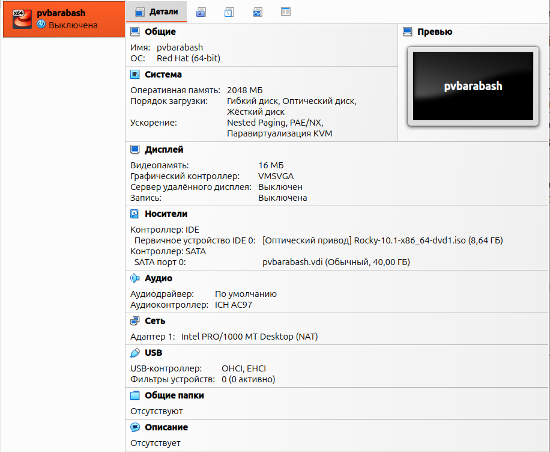
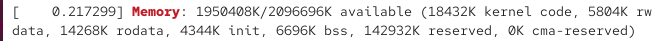
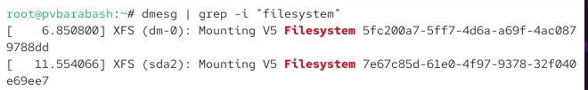

---
## Front matter
lang: ru-RU
title: Презентация лабораторной работы
subtitle: Лабораторная №1
author:
  - Барабаш П. В.
institute:
  - Российский университет дружбы народов, Москва, Россия
date: 21 февраля 2026

## i18n babel
babel-lang: russian
babel-otherlangs: english

## Formatting pdf
toc: false
toc-title: Содержание
slide_level: 2
aspectratio: 169
section-titles: true
theme: metropolis
header-includes:
 - \metroset{progressbar=frametitle,sectionpage=progressbar,numbering=fraction}
 - '\makeatletter'
 - '\beamer@ignorenonframefalse'
 - '\makeatother'
 
 
## Fonts
mainfont: PT Serif
romanfont: PT Serif
sansfont: PT Sans
monofont: PT Mono
mainfontoptions: Ligatures=TeX
romanfontoptions: Ligatures=TeX
sansfontoptions: Ligatures=TeX,Scale=MatchLowercase
monofontoptions: Scale=MatchLowercase,Scale=0.9

---

## Докладчик

:::::::::::::: {.columns align=center}
::: {.column width="70%"}

  * Барабаш Полина Витальевна
  * студентка 2 курса, НПИбд-01-24
  * Российский университет дружбы народов
  * [1132231841@rudn.ru](mailto:1132231841@rudn.ru)

:::
::: {.column width="30%"}

:::
::::::::::::::

## Цели и задачи

Цель: приобретение практических навыков установки операционной системы на виртуальную машину, настройки минимально необходимых для дальнейшей работы сервисов.

Задачи:

- Создать виртуальную машину

- Установить операционную систему

- Найти необходимую информацию

# Выполнение лабораторной работы

## Создание виртуальной машины

## Установка операционной системы

## Версия ядра Linux

## Частота процессора

## Модель процессора

## Объем доступной оперативной памяти

## Тип гипервизора

## Файловая система

## Итоговый слайд

Операционная система на виртуальную машину была установлена и были настроены минимально необходимые для дальнейшей работы сервисы.

