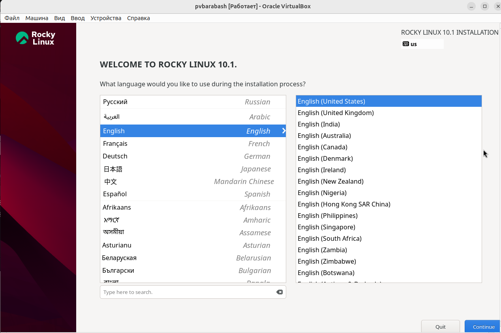
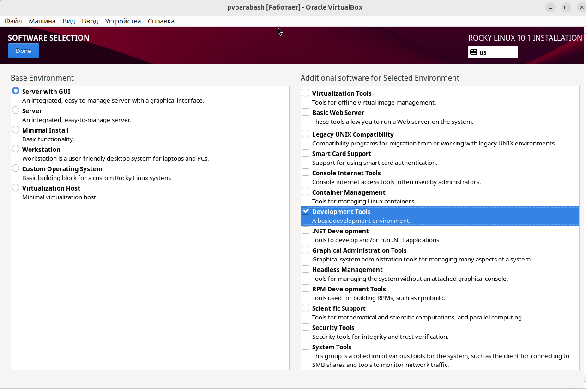
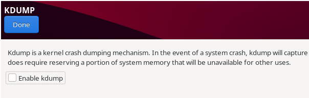
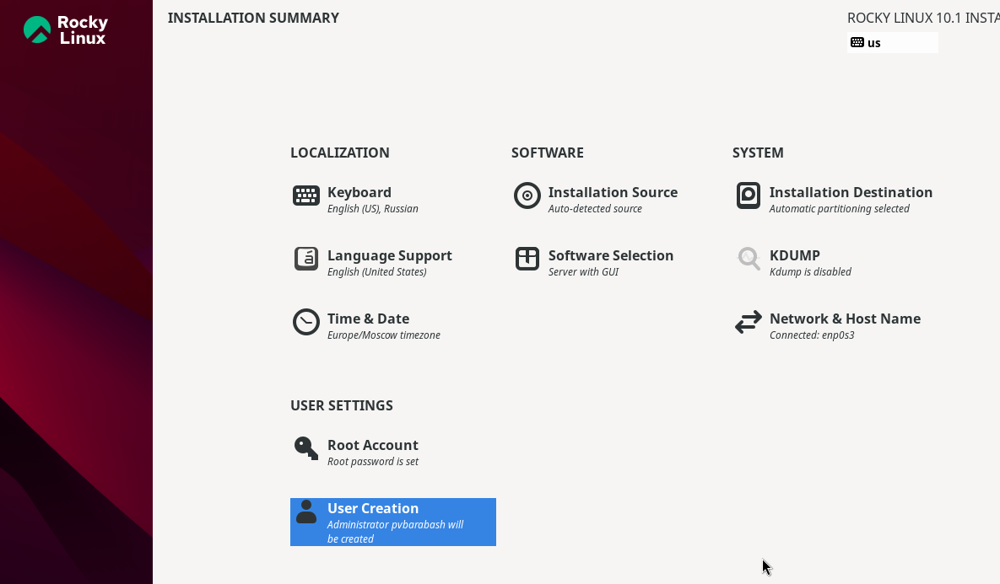
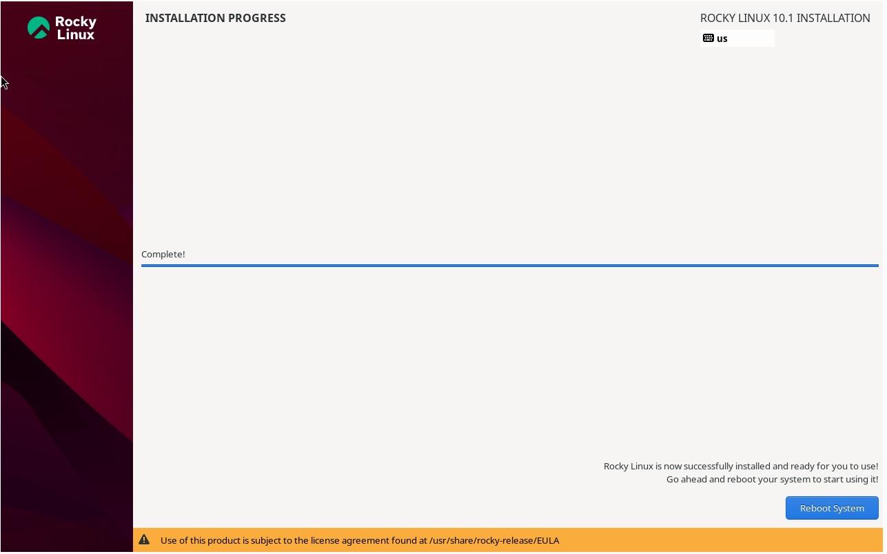
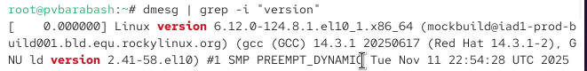
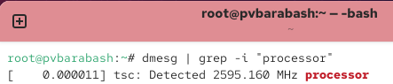
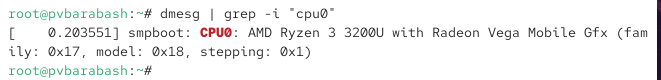
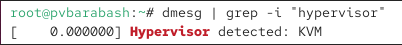

---
## Front matter
title: "Отчёт по лабораторной работе"
subtitle: "Лабораторная №1"
author: "Полина Витальевна Барабаш"

## Generic otions
lang: ru-RU
toc-title: "Содержание"

## Pdf output format
toc: true # Table of contents
toc-depth: 2
lof: true # List of figures
fontsize: 12pt
linestretch: 1.5
papersize: a4
documentclass: scrreprt
## I18n polyglossia
polyglossia-lang:
  name: russian
  options:
	- spelling=modern
	- babelshorthands=true
polyglossia-otherlangs:
  name: english
## I18n babel
babel-lang: russian
babel-otherlangs: english
## Fonts
mainfont: PT Serif
romanfont: PT Serif
sansfont: PT Sans
monofont: PT Mono
mainfontoptions: Ligatures=TeX
romanfontoptions: Ligatures=TeX
sansfontoptions: Ligatures=TeX,Scale=MatchLowercase
monofontoptions: Scale=MatchLowercase,Scale=0.9
## Biblatex
biblatex: true
biblio-style: "gost-numeric"
biblatexoptions:
  - parentracker=true
  - backend=biber
  - hyperref=auto
  - language=auto
  - autolang=other*
  - citestyle=gost-numeric
## Pandoc-crossref LaTeX customization
figureTitle: "Рис."
listingTitle: "Листинг"
lofTitle: "Список иллюстраций"
lolTitle: "Листинги"
## Misc options
indent: true
header-includes:
  - \usepackage{indentfirst}
  - \usepackage{float} # keep figures where there are in the text
  - \floatplacement{figure}{H} # keep figures where there are in the text
---
# Цель работы

Целью данной работы является приобретение практических навыков установки операционной системы на виртуальную машину, настройки минимально необходимых для дальнейшей работы сервисов.

# Выполнение лабораторной работы

Задание 1. Создайте новую виртуальную машину.

Я  в VirtualBox выбрала "создать" машину, именем виртуальной машины выбрала свое имя в дисплейном классе -- pvbarabash. Указала тип операционной системы — Linux, RedHat (64-bit),  размер основной памяти виртуальной машины 2048 МБ. Задала конфигурацию жёсткого диска — загрузочный, VDI (BirtualBox Disk Image), динамический виртуальный диск. Добавила новый привод оптических дисков и выбрала зараннее скачанный образ операционной системы. Созданная виртуальная машина на (рис. [-@fig:001]).

{#fig:001 width=70%}

Задание 2. Запустите виртуальную машину. Настроить всё необходимое перед установкой операционной системы.

Я выбрала английский язык в качестве языка интерфейса (рис. [-@fig:002]). В качестве базового окружения выбрала Server with GUI , а в качестве дополнения — Development Tools (рис. [-@fig:003]).

{#fig:002 width=70%}

{#fig:003 width=70%}

Я отключила KDUMP (рис. [-@fig:004]).

{#fig:004 width=70%}

Место установки ОС оставьте без изменения. Добавила пользователя и суперпользователя, тем самым настроив всё необходимое (рис. [-@fig:005]).

{#fig:005 width=70%}

Я установила дистрибутив Rocky операционной системы Linux (рис. [-@fig:006]).

{#fig:006 width=70%}

Задание 3. Дождитесь загрузки графического окружения и откройте терминал. В окне терминала проанализируйте последовательность загрузки системы, выполнив команду dmesg. 
Получите следующую информацию:
1. Версия ядра Linux (Linux version).
2. Частота процессора (Detected Mhz processor).
3. Модель процессора (CPU0).
4. Объем доступной оперативной памяти (Memory available).
5. Тип обнаруженного гипервизора (Hypervisor detected).
6. Тип файловой системы корневого раздела.
7. Последовательность монтирования файловых систем.

Я использовала шаблон команды поиска: dmesg | grep -i "то, что ищем".

1. Версия ядра Linux: 6.12.0-124.8.1.el10_1.x86_64 (рис. [-@fig:007]).

{#fig:007 width=70%}

2. Частота процессора: 2595.160 MHz (рис. [-@fig:008]).

{#fig:008 width=70%}

3. Модель процессора: AMD Ryzen 3 3200U with Radeon Vega Mobile Gfx (рис. [-@fig:009]).

{#fig:009 width=70%}

4. Объем доступной оперативной памяти: 1950408K (рис. [-@fig:010]).

{#fig:010 width=70%}

5. Тип обнаруженного гипервизора: KVM (рис. [-@fig:011]).

{#fig:011 width=70%}

6. Тип файловой системы корневого раздела: XFS (рис. [-@fig:011]).

7. Последовательность монтирования файловых систем: сначала dm-0, затем sda2 (рис. [-@fig:011]).

{#fig:011 width=70%}

# Ответы на вопросы

1. Какую информацию содержит учётная запись пользователя?

Системное имя, идентификатор пользователя, идентификатор группы, полное имя, домашний каталог, командная оболочка.

2. Укажите команды терминала и приведите примеры.

Для получения справки по команде используется команда man, например, чтобы посмотреть руководство по команде man нужно ввести команду man man.

Для перемещения по файловой системе используется команда cd, например, чтобы перейти в каталог Загрузки, нужно ввести команду cd home/Загрузки.

Для просмотра содержимого каталога используется команда ls, например, чтобы посмотреть содержание каталога Загрузки, нужно ввести команду ls home/Загрузки.

Для определения объёма каталога используется команда du, например, чтобы посмотреть объём каталога Загрузки, нужно ввести команду du home/Загрузки.

Для создания каталогов используется команда mkdir (например, при использовании команды mkdir home/pvbarabash будет создан каталог pvbarabash), для удаления пустого каталога используется команда rmdir (например, rmdir pvbarabash), если каталог не пустой, то система выдаст ошибку. Для удаления каталога с файлами необходимо использовать команду rm -R, которая рекурсивно удаляет всё содержимое (например, rm -R pvbarabash).

Для создания файлов используется команда touch, например touch text.txt. Для удаления используется команда rm, например rm text.txt.

Для задания определённых прав на файл/каталог используется команда chmod, например chmod 750 text.txt.

Для просмотра истории команд используется команда history, например, чтобы посмотреть историю команд для терминала запускается просто команда history.

3. Что такое файловая система? Приведите примеры с краткой характеристикой.

Файловая система — это структура, используемая операционной системой для организации и управления файлами на устройстве хранения, например на жестком диске, твердотельном накопителе (SSD) или USB-накопителе.

XFS — для больших хранилищ, хорошо работает с крупными файлами.

ext2/ext3/ext4 — стандартные для Linux. ext4 — самая распространённая: поддерживает большие файлы, журналирование, высокую скорость.

4. Как посмотреть, какие файловые системы подмонтированы в ОС?

Для просмотра подмонтированных файловых систем используется команда findmnt.

5. Как удалить зависший процесс?
Чтобы удалить зависший процесс, нужно нажать клавиши Alt+F4 или Alt+Fn+F4. 

# Выводы

При выполнении данной лабораторной работы я приобрела практические навыки установки операционной системы на виртуальную машину и настройки минимально необходимых для дальнейшей работы сервисов.
