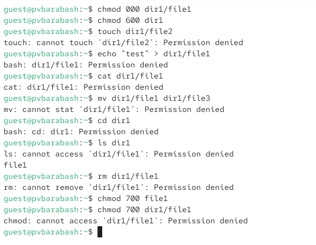
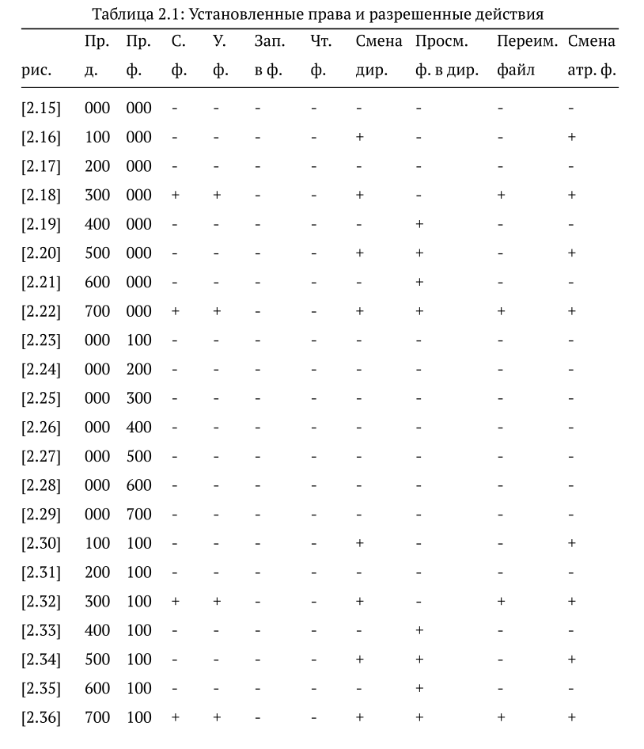
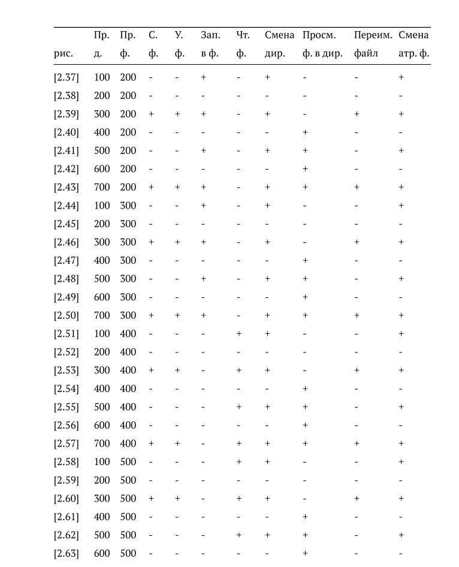
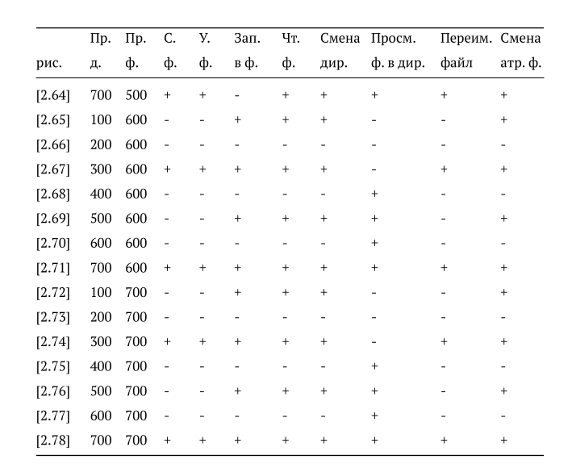
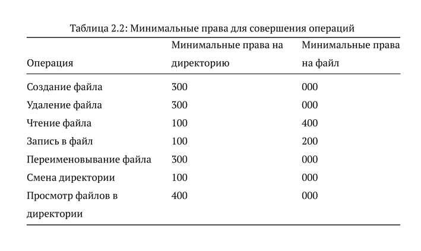

---
## Front matter
lang: ru-RU
title: Презентация лабораторной работы
subtitle: Лабораторная №2
author:
  - Барабаш П. В.
institute:
  - Российский университет дружбы народов, Москва, Россия
date: 07 марта 2026

## i18n babel
babel-lang: russian
babel-otherlangs: english

## Formatting pdf
toc: false
toc-title: Содержание
slide_level: 2
aspectratio: 169
section-titles: true
theme: metropolis
header-includes:
 - \metroset{progressbar=frametitle,sectionpage=progressbar,numbering=fraction}
 - '\makeatletter'
 - '\beamer@ignorenonframefalse'
 - '\makeatother'
 
 
## Fonts
mainfont: PT Serif
romanfont: PT Serif
sansfont: PT Sans
monofont: PT Mono
mainfontoptions: Ligatures=TeX
romanfontoptions: Ligatures=TeX
sansfontoptions: Ligatures=TeX,Scale=MatchLowercase
monofontoptions: Scale=MatchLowercase,Scale=0.9

---

## Докладчик

:::::::::::::: {.columns align=center}
::: {.column width="70%"}

  * Барабаш Полина Витальевна
  * студентка 2 курса, НПИбд-01-24
  * Российский университет дружбы народов
  * [1132231841@rudn.ru](mailto:1132231841@rudn.ru)

:::
::: {.column width="30%"}

:::
::::::::::::::

## Цели и задачи

Цель: получение практических навыков работы в консоли с атрибутами файлов, закрепление теоретических основ дискреционного разграничения доступа в современных системах с открытым кодом на базе ОС Linux

## Создание пользователя

## Переключение на домашнюю директорию

## Информация команд id и groups

## Просмотр прав доступа

## Просмотр расширенных атрибутов

## Права доступа

- 100 -- исполнение пользователем
- 200 -- запись пользователем
- 300 -- исполнение + запись пользователем
- 400 -- чтение пользователем
- 500 -- исполнение + чтение пользователем
- 600 -- запись + чтение пользователем
- 700 -- исполнение + запись + чтение пользователем

## Пример выполнения основного задания

## Результаты, ч.1

## Результаты, ч.2

## Результаты, ч.3

## Минимальные права для совершения операций

## Выводы

Я получила практические навыки работы в консоли с атрибутами файлов, закрепила теоретические основы дискреционного разграничения доступа в современных системах с открытым кодом на базе ОС Linux.
