---
## Front matter
title: "Отчёт по лабораторной работе"
subtitle: "Лабораторная №2"
author: "Полина Витальевна Барабаш"

## Generic otions
lang: ru-RU
toc-title: "Содержание"

## Bibliography
bibliography: bib/cite.bib
csl: pandoc/csl/gost-r-7-0-5-2008-numeric.csl

## Pdf output format
toc: true # Table of contents
toc-depth: 2
lof: true # List of figures
lot: true # List of tables
fontsize: 12pt
linestretch: 1.5
papersize: a4
documentclass: scrreprt
## I18n polyglossia
polyglossia-lang:
  name: russian
  options:
	- spelling=modern
	- babelshorthands=true
polyglossia-otherlangs:
  name: english
## I18n babel
babel-lang: russian
babel-otherlangs: english
## Fonts
mainfont: PT Serif
romanfont: PT Serif
sansfont: PT Sans
monofont: PT Mono
mainfontoptions: Ligatures=TeX
romanfontoptions: Ligatures=TeX
sansfontoptions: Ligatures=TeX,Scale=MatchLowercase
monofontoptions: Scale=MatchLowercase,Scale=0.9
## Biblatex
biblatex: true
biblio-style: "gost-numeric"
biblatexoptions:
  - parentracker=true
  - backend=biber
  - hyperref=auto
  - language=auto
  - autolang=other*
  - citestyle=gost-numeric
## Pandoc-crossref LaTeX customization
figureTitle: "Рис."
tableTitle: "Таблица"
listingTitle: "Листинг"
lofTitle: "Список иллюстраций"
lotTitle: "Список таблиц"
lolTitle: "Листинги"
## Misc options
indent: true
header-includes:
  - \usepackage{indentfirst}
  - \usepackage{float} # keep figures where there are in the text
  - \floatplacement{figure}{H} # keep figures where there are in the text
---

# Цель работы

Получение практических навыков работы в консоли с атрибутами файлов, закрепление теоретических основ дискреционного разграничения доступа в современных системах с открытым кодом на базе ОС Linux [@tuis].

# Выполнение лабораторной работы

**Задание 1.** В установленной при выполнении предыдущей лабораторной работы операционной системе создайте учётную запись пользователя guest (используя учётную запись администратора).

Я получила права администратора командой su - и с помощью команды useradd guest создала пользователя guest (рис. [-@fig:001]).

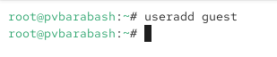{#fig:001 width=70%}

**Задание 2.** Задайте пароль для пользователя guest (использую учётную запись администратора).

Я использовала команду passwd guest и задала пароль пользователю (рис. [-@fig:002]).

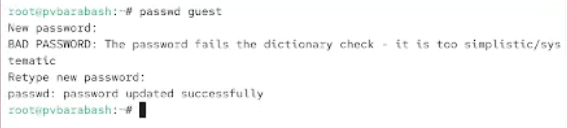{#fig:002 width=70%}

 
**Задание 3.** Войдите в систему от имени пользователя guest.

Я вошла в систему от имени пользователя guest с помощью команды su guest (рис. [-@fig:003]).

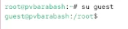{#fig:003 width=70%}

**Задание 4.** Определите директорию, в которой вы находитесь, командой pwd. Сравните её с приглашением командной строки. Определите, является ли она вашей домашней директорией? Если нет, зайдите в домашнюю директорию.

С помощью команды pwd я получила путь, он соответствует приглашению командной строки (рис. [-@fig:004]).

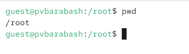{#fig:004 width=70%}

Однако указан был путь /root (соответствующий администратору). Выполнив cd ~, я перешла в домашний каталог пользователя guest и ввела pwd, получив путь /home/guest (рис. [-@fig:005]).

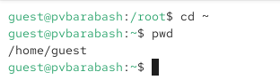{#fig:005 width=70%}

**Задание 5.** Уточните имя вашего пользователя командой whoami.

С помощью команды whoami я уточнила, что нахожусь в пользователе guest (рис. [-@fig:006]).

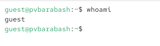{#fig:006 width=70%}

**Задание 6.** Уточните имя вашего пользователя, его группу, а также группы, куда входит пользователь, командой id. Выведенные значения uid, gid и др. запомните. Сравните вывод id с выводом команды groups.

Сначала я выполнила команду id, получив результат, что пользователь guest имеет идентификатор 1001, сначала указано имя пользователя, потом основная группа, к которой он принадлежит, а потом список всех групп, к которым он принадлежит. Затем я ввела команду groups, которая показала список групп, в которых числится пользователь. В случае пользователя guest он состоит только в группе guest, что можно видеть как в выводе id, так и в выводе команды groups (рис. [-@fig:007]).

{#fig:007 width=70%}

**Задание 7.** Сравните полученную информацию об имени пользователя с данными, выводимыми в приглашении командной строки.

В приглашении командной строки указано guest@pvbarabash, то есть имя пользователя указано в приглашении командной строки (соответствует данным полученной информации).

**Задание 8.** Просмотрите файл /etc/passwd. Найдите в нём свою учётную запись. Определите uid пользователя. Определите gid пользователя. Сравните найденные значения с полученными в предыдущих пунктах.

Я использовала команду cat /etc/passwd с фильтром | grep guest и получила информацию о пользователе: 
guest:x:1001:1001::/home/guest:/bin/bash, что соответствует полученным раннее выводам uid и gid (рис. [-@fig:008]).

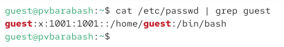{#fig:008 width=70%}

**Задание 9.** Определите существующие в системе директории. Удалось ли вам получить список поддиректорий директории /home? Какие права установлены на директориях?.

Я использовала команду ls -l /home/ и получила две поддиректории по количеству созданных пользователей. Оба пользователя (pvbarabash и guest) имееют полные права на то, чем владеют, но запрещают пользователям, с которыми состоят в одной группе и другим пользователям иметь доступ к их файлам (рис. [-@fig:009]).

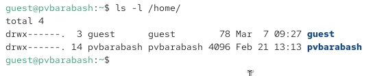{#fig:009 width=70%}

**Задание 10.** Проверьте, какие расширенные атрибуты установлены на поддиректориях, находящихся в директории /home, командой: lsattr /home

Удалось ли вам увидеть расширенные атрибуты директории?

Удалось ли вам увидеть расширенные атрибуты директорий других пользователей?

Я ввела команду lsattr /home, для пользователя guest получилось увидеть отсутствие расширенных атрибутов, а для другого пользователя было выведено сообщение об отсутствии прав на получение их (рис. [-@fig:010]).

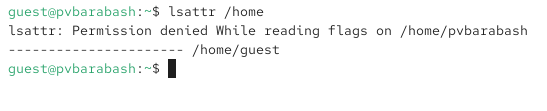{#fig:010 width=70%}

**Задание 11.** Создайте в домашней директории поддиректорию dir1. Определите командами ls -l и lsattr, какие права доступа и расширенные атрибуты были выставлены на директорию dir1.

Я создала директорию dir1 в домашней директории guest с помощью mkdir, затем проверила права доступа и расширенные атрибуты с помощью ls -l и lsattr соответственно (рис. [-@fig:011]) 

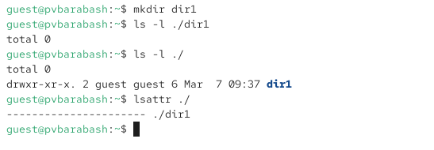{#fig:011 width=70%}

Автоматически были выставлены права rwx-r-x-r-x на директорию и отсутствовали расширенные атрибуты.

**Задание 12.** Снимите с директории dir1 все атрибуты командой chmod 000 dir1 и проверьте с помощью команды ls -l правильность выполнения команды chmod.

Я сняла все атрибуты командой chmod 000 dir1 и проверила корректность командой  ls -l (рис. [-@fig:012]).

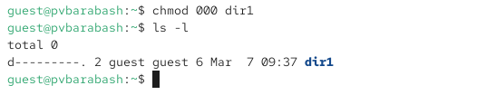{#fig:012 width=70%}

Действительно права доступа стали указаны как --------- (то есть отсуствие прав). 

**Задание 13.** Попытайтесь создать в директории dir1 файл file1. Объясните, почему вы получили отказ в выполнении операции по созданию файла?
Оцените, как сообщение об ошибке отразилось на создании файла? Проверьте командой ls -l /home/guest/dir1 действительно ли файл file1 не находится внутри директории dir1.

Я создала файл file1 с помощью команды echo "test" > /home/guest/dir1/file1. И получила отказ в выполнении операции (рис. [-@fig:013]). 

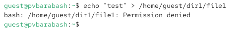{#fig:013 width=70%}

Затем я использовала команду ls -l /home/guest/dir1, но вновь получила запрет на просмотр файлов в директории (рис. [-@fig:014]). 

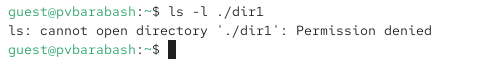{#fig:014 width=70%}

**Задание 14.** Заполните таблицу «Установленные права и разрешённые действия», выполняя действия от имени владельца директории (файлов), определив опытным путём, какие операции разрешены, а какие нет.
Если операция разрешена, занесите в таблицу знак «+», если не разрешена, знак «-».

Для выполнения задания я последовательно задавала директории права и файлу file1 с помощью команды chmod <права>. Далее я создавала файл (в таблице сокращение С. ф.) с помощью команды touch, удаляла файл (см. сокращ. У.ф.) с помощью команды rm, записывала в файл с помощью команды echo и перенаправления > (см. сокращ. Зап. в ф.), читала файл с помощью cat (сокращ Чт.ф), меняла директорию через переход в неё командой cd dir1 (сокращ. Смена дир.), просматривала файлы в директории с помощью ls (сокращ. Просм. ф. в дир.) и переименовывала файл с помощью mv dir1/file1 dir1/file3 (сокращ. Переим. файл). Смена атрибуба файла -- сокращ. Смена атр. ф..

Все действия проиллюстрированы изображениями (добавленная первая колонка).

Права доступа:

- 100 -- исполнение пользователем

- 200 -- запись пользователем

- 300 -- исполнение + запись пользователем

- 400 -- чтение пользователем

- 500 -- исполнение + чтение пользователем

- 600 -- запись + чтение пользователем

- 700 -- исполнение + запись + чтение пользователем

Результаты см. [табл. @tbl:01].

|    рис.     | Пр. д.| Пр. ф. | С. ф. | У. ф. | Зап. в ф. | Чт. ф. | Смена дир. | Просм. ф. в дир. | Переим. файл  | Смена атр. ф.|
|-------------|-------|--------|-------|-------|-----------|--------|------------|------------------|---------------|--------------|
| [-@fig:021] | 000   | 000    |  -    |  -    |   -       |  -     |  -         |       -          |      -        |     -        |
| [-@fig:073] | 100   | 000    |   -   |  -    |      -    |   -    |      +     |       -          |      -        |      +       |
| [-@fig:074] | 200   | 000    |   -   |    -  |     -     |     -  |     -      |        -         |        -      |      -       |
| [-@fig:075] | 300   | 000    |  +  |  +  |  -  |  -  |  +  | -   |  +  |  +  |
| [-@fig:022] | 400   | 000    |  -  |  -  |  -  |  -  |  -  |  +  |  -  |  -  |
| [-@fig:023] | 500   | 000    |  - |  -  |  -  |  -  |  +  |  +  |  -  |  +  |
| [-@fig:076] | 600   | 000    | -  |  -  |  -  |  -  |  -  |  +  |  -  |  -  |
| [-@fig:024] | 700   | 000    | + |  +  |  -  |  -  |  +  |  +  |  +  |  +  |
| [-@fig:015] | 000   | 100    |  -  |  -  |  -  |  -  |  -  |  -  |  -  |  -  |
| [-@fig:016] | 000   | 200    | -  |  -  |  -  |  -  |  -  |  -  |  -  |  -  |
| [-@fig:017] | 000   | 300    |  -  |  -  |  -  |  -  |  -  |  -  |  -  |  -  |
| [-@fig:077] | 000   | 400    | -  |  -  |  -  |  -  |  -  |  -  |  -  |  -  |
| [-@fig:018] | 000   | 500    |  - |  -  |  -  |  -  |  -  |  -  |  -  |  -  |
| [-@fig:019] | 000   | 600    | -  |  -  |  -  |  -  |  -  |  -  |  -  |  -  |
| [-@fig:020] | 000   | 700    | -  |  -  |  -  |  -  |  -  |  -  |  -  |  -  |
| [-@fig:025] | 100   | 100    |  - |  -  |  -  |  -  |  +  |  -  |  -  |  +  |
| [-@fig:026] | 200   | 100    |  - |  -  |  -  |  -  |  -  |  -  |  -  |  -  |
| [-@fig:027] | 300   | 100    | +  |  +  |  -  |  -  |  +  |  -  |  +  |  +  |
| [-@fig:028] | 400   | 100    | -  |  -  |  -  |  -  |  -  | +  |  -  | -   |
| [-@fig:029] | 500   | 100    | -  |  -  |  -  |  -  |  +  |  +  |  -  |  +  |
| [-@fig:030] | 600   | 100    |  - |  -  |  -  |  -  |  -  |  +  |  -   |  -  |
| [-@fig:031] | 700   | 100    |  +  |  +  |  -  |  -  |  +  |  +  |  +  |  +  |
| [-@fig:032] | 100   | 200    | -  |  -  |  +  |  -  |  +  | -   |  -  |  +  |
| [-@fig:033] | 200   | 200    | -  |  -  |  -  |  -  |  -  |  -  |  -  |  -  |
| [-@fig:034] | 300   | 200    | +  |  +  |  +  |  -  |  +  |  -  | +   |  +  |
| [-@fig:035] | 400   | 200    | -  |  -  |  -  |  -  |  -  |  +  |  -  |  -  |
| [-@fig:036] | 500   | 200    | -  |  -  |  +  |  -  |  +  |  +  |  -  |  +  |
| [-@fig:037] | 600   | 200    |  - |  -  |  -  |  -  |  -  |  +  |  -  |  -  |
| [-@fig:038] | 700   | 200    | +  |  +  |  +  |  -  |  +  |  +  |  +  |  +  |
| [-@fig:039] | 100   | 300    | -  |  -  |  +  |  -  |  +  |  -  |  -  |  +  |
| [-@fig:040] | 200   | 300    | -  |  -  |  -  |  -  |  -  |  -  |  -  |  -  |
| [-@fig:041] | 300   | 300    | +  |  +  |  +  |  -  |  +  |  -  |  +  |  +  |
| [-@fig:042] | 400   | 300    |  - |  -  |  -  |  -  |  -  |  +  |  -  |  -  |
| [-@fig:043] | 500   | 300    | -  |  -  |  +  |  -  |  +  |  +  |  -  |  +  |
| [-@fig:044] | 600   | 300    |  - |  -  |  -  |  -  |  -  |  +  |  -  |  -  |
| [-@fig:045] | 700   | 300    | +  |  +  |  +  | -   |  +  |  +  |  +  |  +   |
| [-@fig:046] | 100   | 400    |  - |  -  |  -  |  +  |  +  | -   |  -  |  +  |
| [-@fig:047] | 200   | 400   | -  |  -  |  -  |  -  |  -  |  -  |  -  |  -  |
| [-@fig:048] | 300   | 400   |  + |  +  |  -  |  +  |  +  |  -  |  +  |  +  |
| [-@fig:049] | 400   | 400 | -  |  -  |  -  |  -  |  -  |  +  |  -  | -  |
| [-@fig:050] | 500   | 400   | -  |  -  |  -  |  +  |  +  |  +  |  -  |  +  |
| [-@fig:051] | 600   | 400 | -  |  -  |  -  |  -  |  -  |  +  |  -  | -   |
| [-@fig:052] | 700   | 400   | +  |  +  |  -  |  +  |  +  |  +  |  +  |  +  |
| [-@fig:053] | 100   | 500 | -  |  -  |  -  |  +  |  +  |  -  |  -  |  +  |
| [-@fig:054] | 200   | 500   | -  |  -  |  -  |  -  |  -  |  -  |  -  |  -  |
| [-@fig:055] | 300   | 500 | +  |  +  |  -  |  +  |  +  |  -  |  +  |  +  |
| [-@fig:056] | 400   | 500   | -  |  -  |  -  |  -   |  -  |  +  |  -  |  -  |
| [-@fig:057] | 500   | 500 | -  |  -  |  -  |  +  |  +  |  +  |  -  |  +  |
| [-@fig:058] | 600   | 500   |  - |  -  |  -  |  -  |  -  |  +  |  -  | -   |
| [-@fig:059] | 700   | 500 |  + |  +  |  -  |  +  |  +  |  +  |  +  |  +  |
| [-@fig:060] | 100   | 600   | -  |  -  |  +  |  +  |  +  |  -  |  -  |  +  |
| [-@fig:061] | 200   | 600 | -  |  -  |  -  |  -  |  -  |  -  |  -  |  -  |
| [-@fig:062] | 300   | 600   | +  |  +  |  +  |  +  |  +  |  -  |  +  |  +  |
| [-@fig:063] | 400   | 600 |  - |  -  |  -  |  -  |  -  |  +  |  -  |  -  |
| [-@fig:064] | 500   | 600  | -  |  -  |  +  |  +  |  +  |  +  |  -  |  +  |
| [-@fig:065] | 600   | 600 |  - |  -  |  -  |  -  |  -  |  +  | -   |  -  |
| [-@fig:066] | 700   | 600 | +  |  +  |  +  |  +  |  +  |  +  |  +  |  +  |
| [-@fig:067] | 100   | 700   | -  |  -  |  +  |  +  |  +  |  -  |  -  |  +  |
| [-@fig:068] | 200   | 700 | -  |  -  |  -  |  -  |  -  |  -  |  -  |  -  |
| [-@fig:069] | 300   | 700   |  + |  +  |  +  |  +  |  +  | -   |  +  |  +  |
| [-@fig:070] | 400   | 700 | -  |  -  |  -  |  -  |  -  |  +  |  -  |  -  |
| [-@fig:071] | 500   | 700   |  - |  -  |  +  |  +  |  +  |  +  |  -  |  +  |
| [-@fig:072] | 600   | 700 |  - |  -  |  -  |  -  |  -  |  +  |  -  |  -  |
| [-@fig:078] | 700   | 700   |  + |  +  |  +  |  +  |  +  |  +  |  +  |  +  |

: Установленные права и разрешенные действия {#tbl:01}

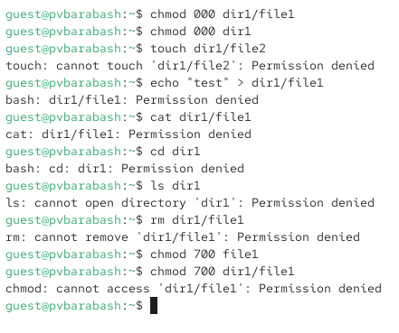{#fig:021 width=70%}

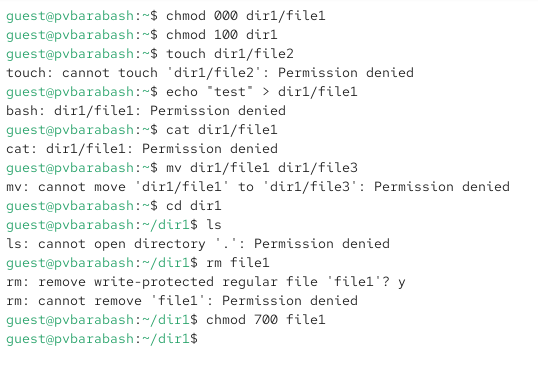{#fig:073 width=70%}

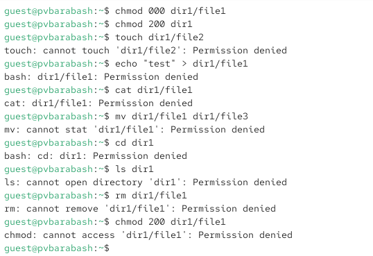{#fig:074 width=70%}

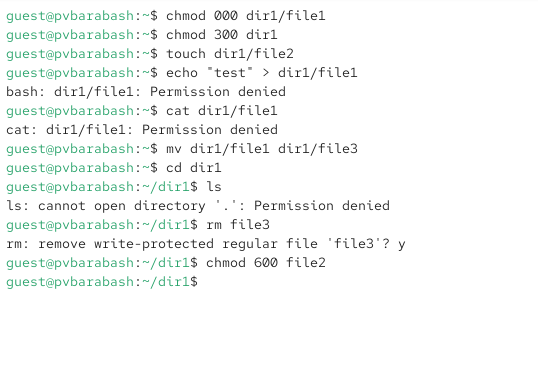{#fig:075 width=70%}

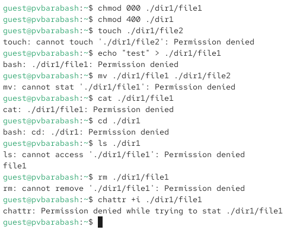{#fig:022 width=70%}

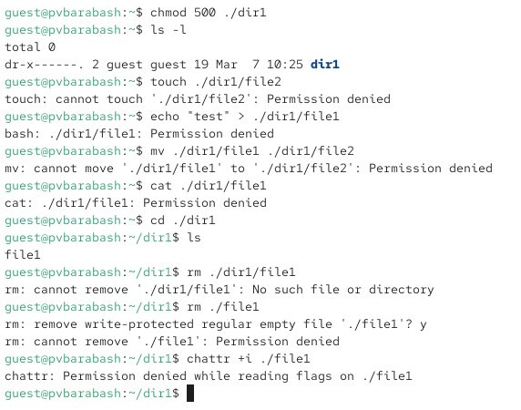{#fig:023 width=70%}

{#fig:076 width=70%}

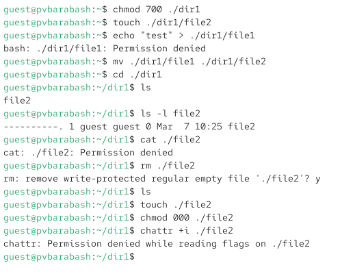{#fig:024 width=70%}

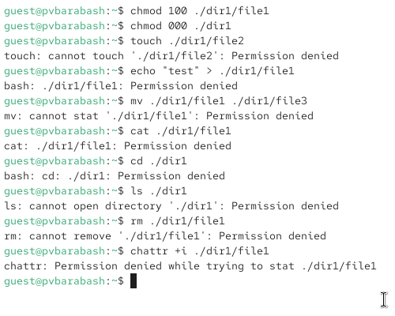{#fig:015 width=70%}

{#fig:016 width=70%}

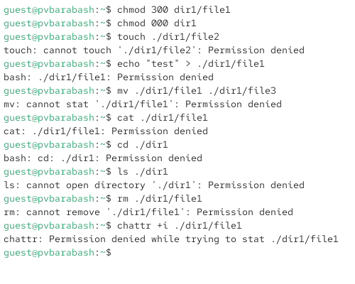{#fig:017 width=70%}

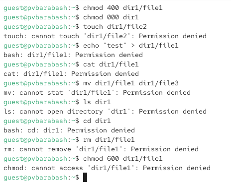{#fig:077 width=70%}

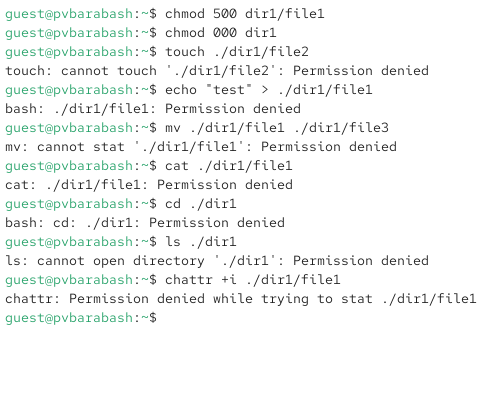{#fig:018 width=70%}

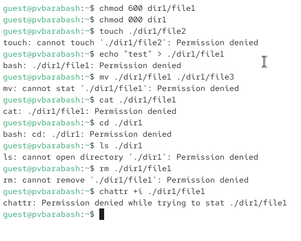{#fig:019 width=70%}

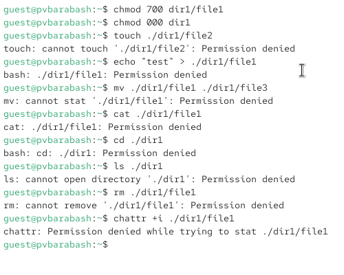{#fig:020 width=70%}

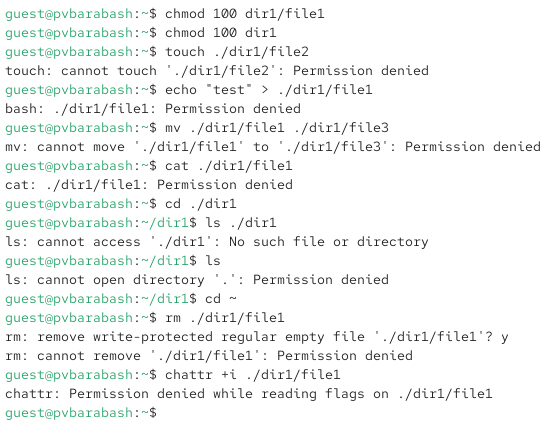{#fig:025 width=70%}

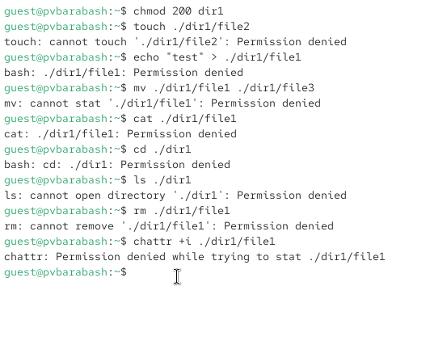{#fig:026 width=70%}

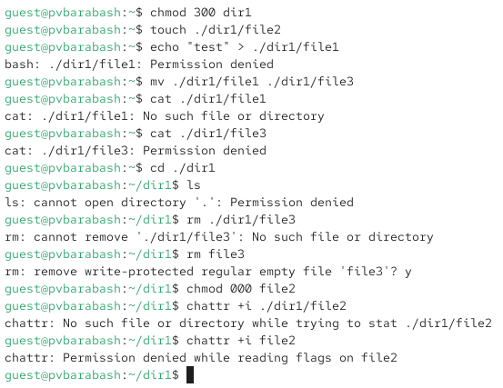{#fig:027 width=70%}

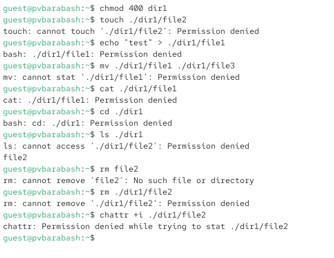{#fig:028 width=70%}

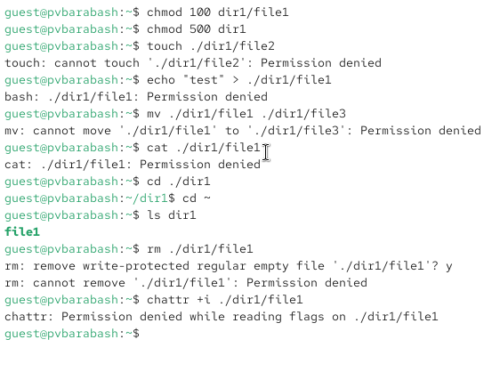{#fig:029 width=70%}

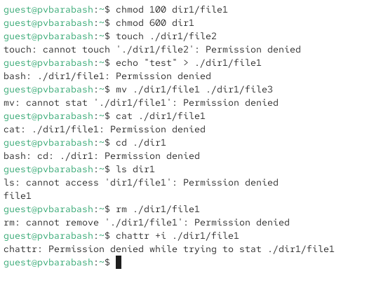{#fig:030 width=70%}

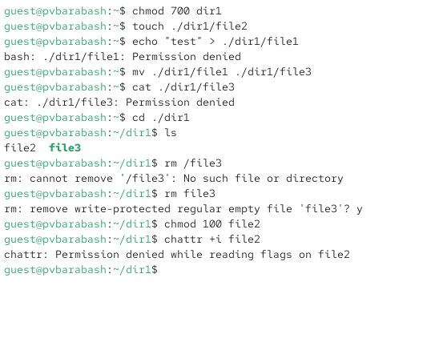{#fig:031 width=70%}

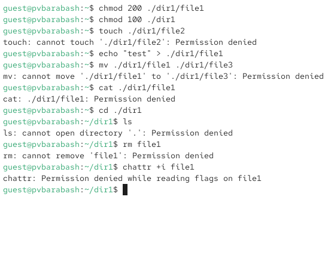{#fig:032 width=70%}

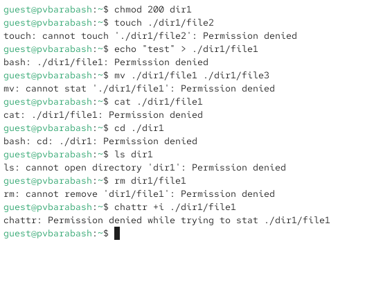{#fig:033 width=70%}

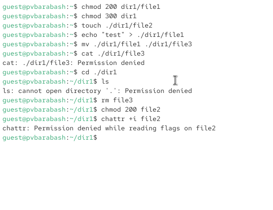{#fig:034 width=70%}

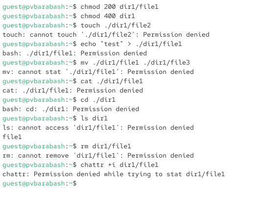{#fig:035 width=70%}

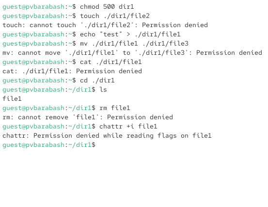{#fig:036 width=70%}

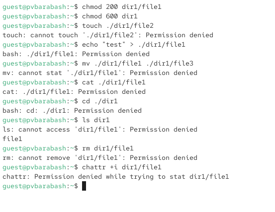{#fig:037 width=70%}

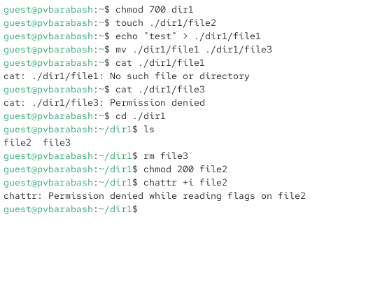{#fig:038 width=70%}

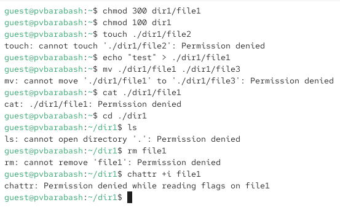{#fig:039 width=70%}

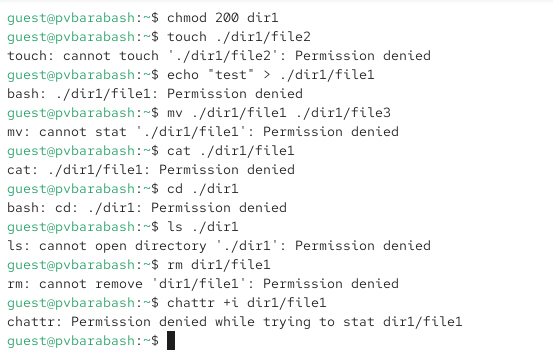{#fig:040 width=70%}

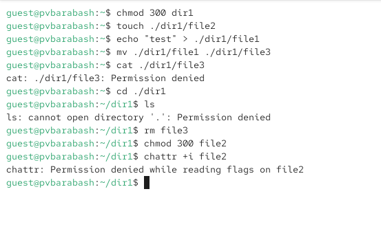{#fig:041 width=70%}

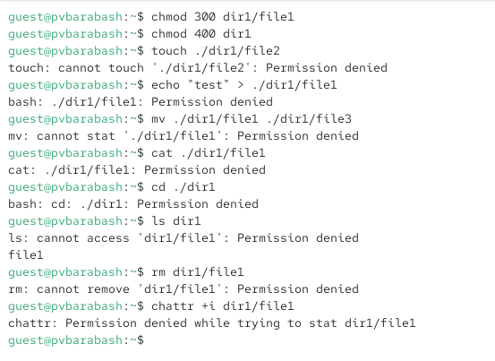{#fig:042 width=70%}

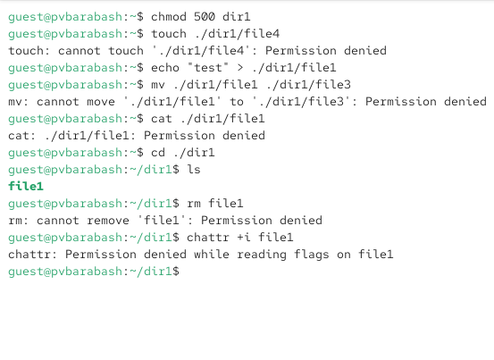{#fig:043 width=70%}

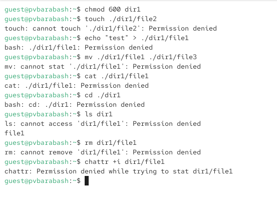{#fig:044 width=70%}

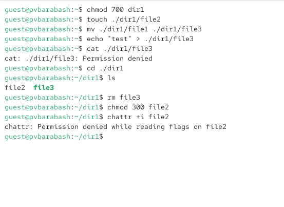{#fig:045 width=70%}

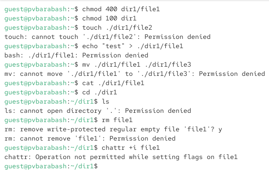{#fig:046 width=70%}

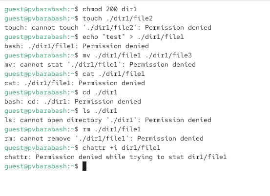{#fig:047 width=70%}

{#fig:048 width=70%}

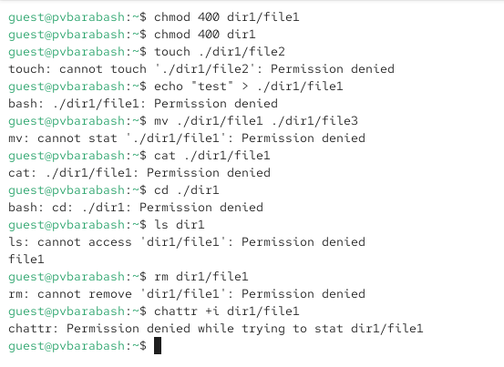{#fig:049 width=70%}

{#fig:050 width=70%}

{#fig:051 width=70%}

{#fig:052 width=70%}

{#fig:053 width=70%}

{#fig:054 width=70%}

{#fig:055 width=70%}

{#fig:056 width=70%}

{#fig:057 width=70%}

{#fig:058 width=70%}

{#fig:059 width=70%}

{#fig:060 width=70%}

{#fig:061 width=70%}

{#fig:062 width=70%}

{#fig:063 width=70%}

{#fig:064 width=70%}

{#fig:065 width=70%}

{#fig:066 width=70%}

{#fig:067 width=70%}

{#fig:068 width=70%}

{#fig:069 width=70%}

{#fig:070 width=70%}

{#fig:071 width=70%}

{#fig:072 width=70%}

{#fig:078 width=70%}

**Задание 15.** На основании заполненной таблицы определите те или иные минимально необходимые права для выполнения операций внутри директории dir1, заполните таблицу.

Я проанализировала таблицу и результаты анализа предоставлены в  [табл. @tbl:02].

| Операция | Минимальные права на директорию | Минимальные права на файл |
|-------------------------------------|---------------------------------|---------------------------|
| Создание файла                |  300  |   000    |
| Удаление файла                |  300  |   000   |
| Чтение файла                   |  100    | 400    |
| Запись в файл                 | 100    | 200  |
| Переименовывание файла        |  300    | 000     |
| Смена директории              |  100  | 000   |
| Просмотр файлов в директории      |  400    | 000    |

: Минимальные права для совершения операций {#tbl:02}

# Выводы

Я получила практические навыки работы в консоли с атрибутами файлов, закрепила теоретические основы дискреционного разграничения доступа в современных системах с открытым кодом на базе ОС Linux.

# Список литературы{.unnumbered}

::: {#refs}
:::
