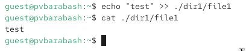
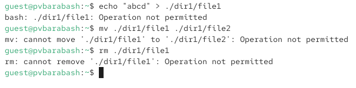

---
## Front matter
lang: ru-RU
title: Презентация лабораторной работы
subtitle: Лабораторная №4
author:
  - Барабаш П. В.
institute:
  - Российский университет дружбы народов, Москва, Россия
date: 30 марта 2026

## i18n babel
babel-lang: russian
babel-otherlangs: english

## Formatting pdf
toc: false
toc-title: Содержание
slide_level: 2
aspectratio: 169
section-titles: true
theme: metropolis
header-includes:
 - \metroset{progressbar=frametitle,sectionpage=progressbar,numbering=fraction}
 - '\makeatletter'
 - '\beamer@ignorenonframefalse'
 - '\makeatother'
 
 
## Fonts
mainfont: PT Serif
romanfont: PT Serif
sansfont: PT Sans
monofont: PT Mono
mainfontoptions: Ligatures=TeX
romanfontoptions: Ligatures=TeX
sansfontoptions: Ligatures=TeX,Scale=MatchLowercase
monofontoptions: Scale=MatchLowercase,Scale=0.9

---

## Докладчик

:::::::::::::: {.columns align=center}
::: {.column width="70%"}

  * Барабаш Полина Витальевна
  * студентка 2 курса, НПИбд-01-24
  * Российский университет дружбы народов
  * [1132231841@rudn.ru](mailto:1132231841@rudn.ru)

:::
::: {.column width="30%"}

:::
::::::::::::::

## Цели и задачи

Цель: получение практических навыков работы в консоли с расширенными атрибутами файлов

## Используемые расширенные атрибуты

Атрибут a (Append-only/Только добавление) — файл можно открыть только для записи в конец (append), но нельзя удалить, переименовать или перезаписать существующие данные.

Атрибут i (Immutable/Неизменяемый) — файл или каталог нельзя удалить, переименовать, перезаписать или изменить его содержимое.

## Невозможность установить расширенный атрибут на файл владельцем

## Установка расширенного атрибута на файл суперпользователем

## Проверка установленного расширенного атрибута

## Проверка выполнения действия дозаписи в файл с атрибутом a

## Проверка невозможности действий перезаписи, переименования, удаления файла

## Снятие расширенного атрибута а с файла

## Проверка выполнения всех указанных ранее действий

## Установка расширенного атрибута i на файл

## Проверка невозможности выполнения указанных ранее действий

## Выводы

Я повысили свои навыки использования интерфейса командой строки (CLI), познакомились на примерах с тем, как используются расширенные атрибуты при разграничении доступа.
