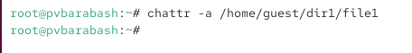
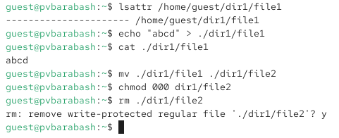
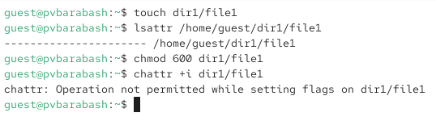

---
## Front matter
title: "Отчёт по лабораторной работе"
subtitle: "Лабораторная №4"
author: "Полина Витальевна Барабаш"

## Generic otions
lang: ru-RU
toc-title: "Содержание"

## Bibliography
bibliography: bib/cite.bib
csl: pandoc/csl/gost-r-7-0-5-2008-numeric.csl

## Pdf output format
toc: true # Table of contents
toc-depth: 2
lof: true # List of figures
lot: true # List of tables
fontsize: 12pt
linestretch: 1.5
papersize: a4
documentclass: scrreprt
## I18n polyglossia
polyglossia-lang:
  name: russian
  options:
	- spelling=modern
	- babelshorthands=true
polyglossia-otherlangs:
  name: english
## I18n babel
babel-lang: russian
babel-otherlangs: english
## Fonts
mainfont: PT Serif
romanfont: PT Serif
sansfont: PT Sans
monofont: PT Mono
mainfontoptions: Ligatures=TeX
romanfontoptions: Ligatures=TeX
sansfontoptions: Ligatures=TeX,Scale=MatchLowercase
monofontoptions: Scale=MatchLowercase,Scale=0.9
## Biblatex
biblatex: true
biblio-style: "gost-numeric"
biblatexoptions:
  - parentracker=true
  - backend=biber
  - hyperref=auto
  - language=auto
  - autolang=other*
  - citestyle=gost-numeric
## Pandoc-crossref LaTeX customization
figureTitle: "Рис."
tableTitle: "Таблица"
listingTitle: "Листинг"
lofTitle: "Список иллюстраций"
lotTitle: "Список таблиц"
lolTitle: "Листинги"
## Misc options
indent: true
header-includes:
  - \usepackage{indentfirst}
  - \usepackage{float} # keep figures where there are in the text
  - \floatplacement{figure}{H} # keep figures where there are in the text
---

# Цель работы

Получение практических навыков работы в консоли с расширенными атрибутами файлов [@tuis].

# Выполнение лабораторной работы

**Задание 1.** От имени пользователя guest определите расширенные атрибуты файла /home/guest/dir1/file1 командой lsattr /home/guest/dir1/file1.

Я перешла в учетную запись пользователя guest командой su guest, затем создала директорию dir1 и файл file1 (mkdir и touch соответственно) и проверила наличие расширенных атрибутов файла file1 командой lsattr /home/guest/dir1/file1 (рис. [-@fig:001]).

{#fig:001 width=70%}

**Задание 2.** Установите командой chmod 600 file1 на файл file1 права, разрешающие чтение и запись для владельца файла.

Я установила права на чтение и запись пользователем файла на файл file1 с помощью команды chmod 600 file1 и проверила командой ls -l (рис. [-@fig:002]).

{#fig:002 width=70%}

 
**Задание 3.** Попробуйте установить на файл /home/guest/dir1/file1 расширенный атрибут a от имени пользователя guest: chattr +a /home/guest/dir1/file1

Я попробовала устновить расширенный атрибут а от имени пользователя guest с помощью команды chattr +a /home/guest/dir1/file1 и получила отказ (рис. [-@fig:003]).

{#fig:003 width=70%}

**Задание 4.** Зайдите на третью консоль с правами администратора либо повысьте свои права с помощью команды su. Попробуйте установить расширенный атрибут a на файл /home/guest/dir1/file1 от имени суперпользователя: chattr +a /home/guest/dir1/file1

Я открыла новый терминал, переключилась на администратора командой su -, а затем установила расширенный атрибут a на файл с помощью команды chattr +a /home/guest/dir1/file1 (рис. [-@fig:004]).

{#fig:004 width=70%}

**Задание 5.** От пользователя guest проверьте правильность установления атрибута: lsattr /home/guest/dir1/file1

От пользователя guest я проверила правильность установления атрибута с помощью команды lsattr /home/guest/dir1/file1 (рис. [-@fig:005]).

{#fig:005 width=70%}

Атрибут установлен верно.

**Задание 6.** Выполните дозапись в файл file1 слова «test». После этого выполните чтение файла file1. Убедитесь, что слово test было успешно записано в file1.

С помощью команды echo "test" >> dir1/file1 я выполнила дозапись в файл file1 слова «test». Затем я использовала cat и убедилась что "test" было записано и выведено (рис. [-@fig:006]).

{#fig:006 width=70%}

**Задание 7.** Попробуйте удалить файл file1 либо стереть имеющуюся в нём информацию командой echo "abcd" > /home/guest/dirl/file1. Попробуйте переименовать файл.

Я попробовала стереть информацию командой перезаписи echo "abcd" > /home/guest/dirl/file1, получив запрет на выполнение команды. Аналогично для команды переименования mv dir1/file1 dir1/file2 и для удаления командой rm (рис. [-@fig:007]).

{#fig:007 width=70%}

**Задание 8.** Попробуйте с помощью команды chmod 000 file1 установить на файл file1 права, например, запрещающие чтение и запись для владельца файла. Удалось ли вам успешно выполнить указанные команды?

Я попробовала с помощью команды chmod 000 file1 установить на файл file1 права, но также получила запрет на выполнение этого действия (рис. [-@fig:008]).

{#fig:008 width=70%}

**Задание 9.** Снимите расширенный атрибут a с файла /home/guest/dirl/file1 от имени суперпользователя.

Я сняла расширенный атрибут а с файла от имени суперпользователя командой chattr -a /home/guest/dir1/file1 (рис. [-@fig:009]).

{#fig:009 width=70%}

**Задание 10.** Повторите операции, которые вам ранее не удавалось выполнить.

Я убедилась, что расширенный атрибут а снят командой lsattr, затем повторила действия перезаписи, переименования, смены прав на файл и удаления файла (рис. [-@fig:010]).

{#fig:010 width=70%}

Как можно видеть на скриншоте все действия были разрешены и выполнены.

**Задание 11.** Повторите ваши действия по шагам, заменив атрибут «a» атрибутом «i». Удалось ли вам дозаписать информацию в файл?

Сначала я создала файл командой touch file1, затем назначила права командой chmod 600 file1 (чтение и запись пользователем), попробовала от имени guest установить расширенных атрибут i, убедилась, что в случае с i, как и с атрибутом a, от имени guest это сделать нельзя (рис. [-@fig:011]).

{#fig:011 width=70%}

Затем от имени суперпользователя я установила расширенный атрибут командой chattr +i /home/guest/dir1/file1 (рис. [-@fig:012]).

{#fig:012 width=70%}

Как и в случае с атрибутом a я проверила могу ли я дозаписать в файл строку, затем переписать текст файла, переименовать файл, поменять права на файл и удалить файл (рис. [-@fig:013]).

{#fig:013 width=70%}

Как можно видеть, все эти действия запрещены. То есть в отличие от атрибута а, с атрибутом i нельзя сделать даже дозапись.

# Выводы

В результате выполнения работы я повысили свои навыки использования интерфейса командой строки (CLI), познакомились на примерах с тем, как используются расширенные атрибуты при разграничении доступа. 

# Список литературы{.unnumbered}

::: {#refs}
:::
