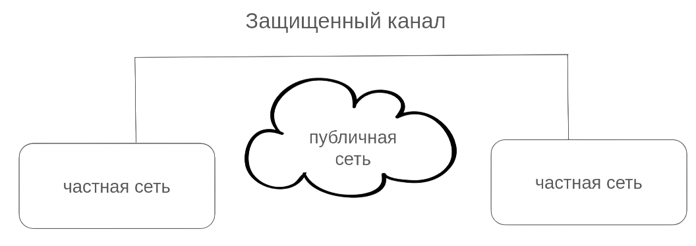
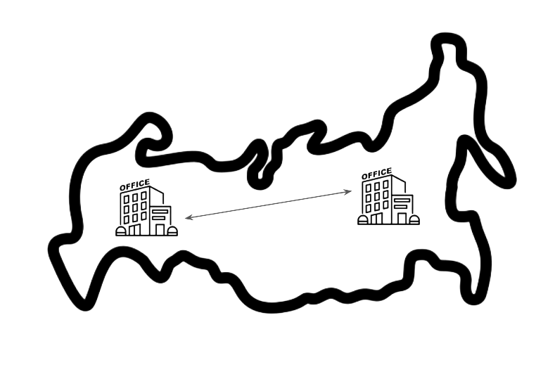
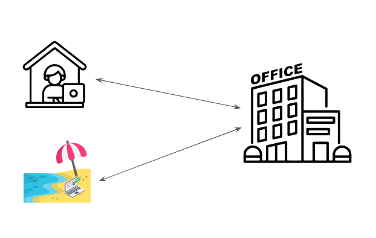
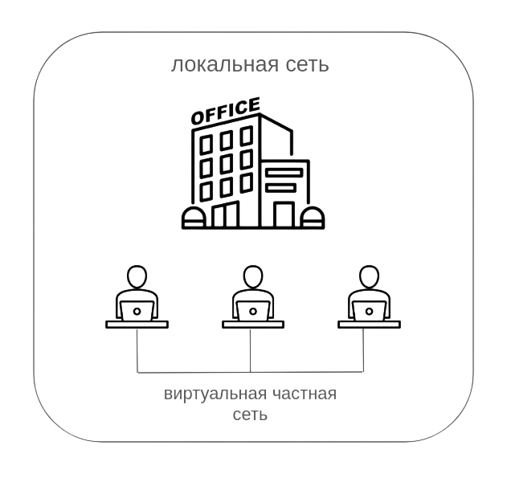
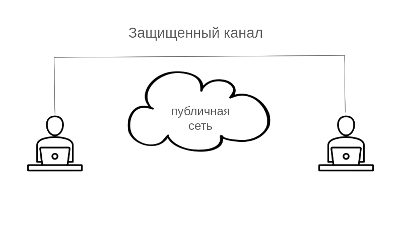
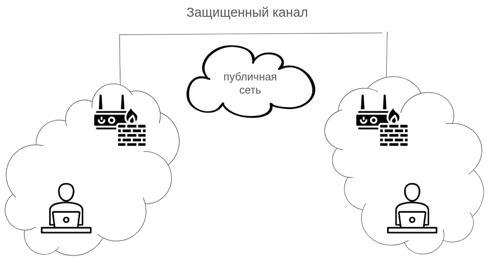
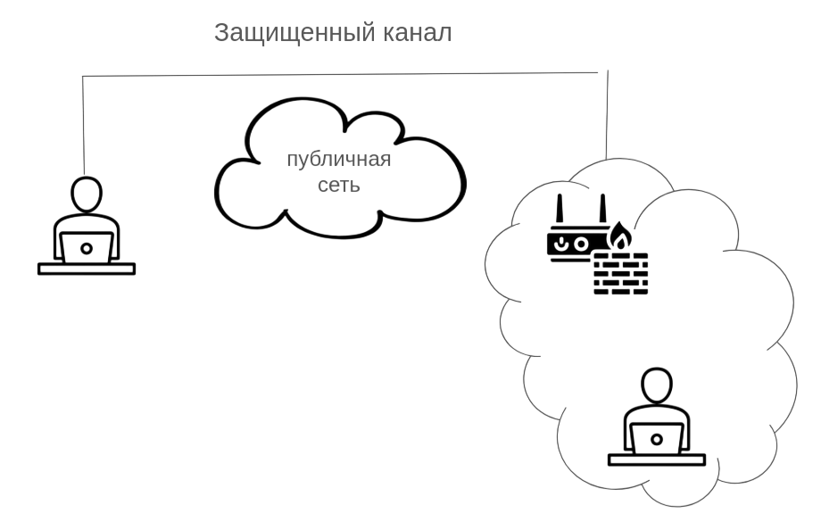
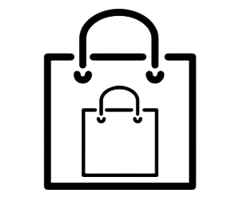
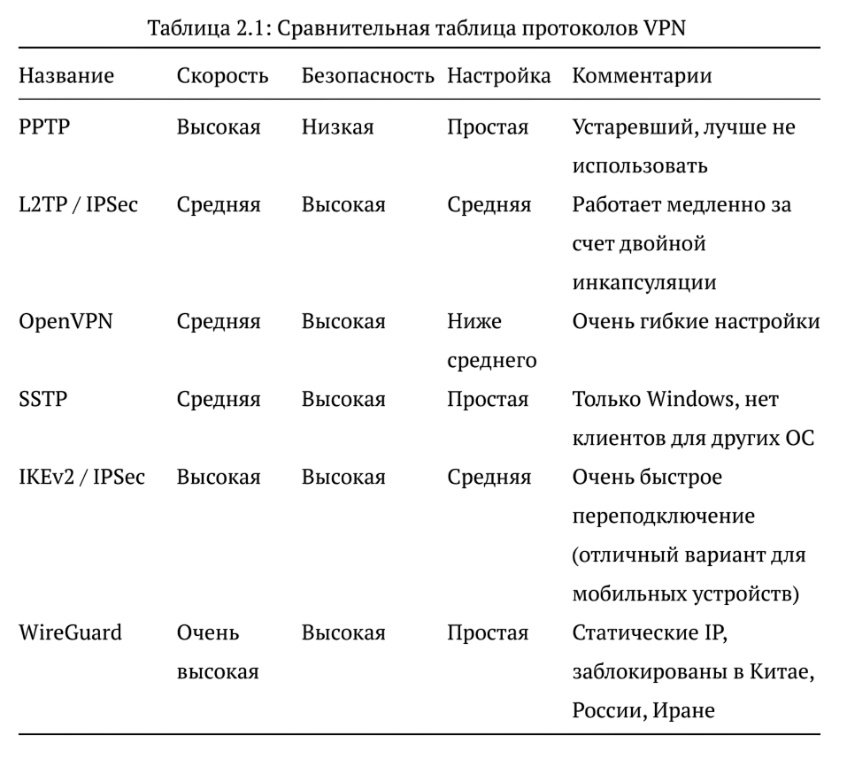

---
## Front matter
lang: ru-RU
title: Доклад по курсу «Основы информационной безопасности»
subtitle: Виртуальные частные сети
author:
  - Барабаш П. В.
institute:
  - Российский университет дружбы народов, Москва, Россия
date: 20 марта 2026

## i18n babel
babel-lang: russian
babel-otherlangs: english

## Formatting pdf
toc: false
toc-title: Содержание
slide_level: 2
aspectratio: 169
section-titles: true
theme: metropolis
header-includes:
 - \metroset{progressbar=frametitle,sectionpage=progressbar,numbering=fraction}
 - '\makeatletter'
 - '\beamer@ignorenonframefalse'
 - '\makeatother'
 
 
## Fonts
mainfont: PT Serif
romanfont: PT Serif
sansfont: PT Sans
monofont: PT Mono
mainfontoptions: Ligatures=TeX
romanfontoptions: Ligatures=TeX
sansfontoptions: Ligatures=TeX,Scale=MatchLowercase
monofontoptions: Scale=MatchLowercase,Scale=0.9

---

## Докладчик

:::::::::::::: {.columns align=center}
::: {.column width="70%"}

  * Барабаш Полина Витальевна
  * студентка 2 курса, НПИбд-00-24
  * Российский университет дружбы народов
  * [1132231841@rudn.ru](mailto:1132231841@rudn.ru)

:::
::: {.column width="30%"}

:::
::::::::::::::

## Введение

 **Виртуальная частная сеть (VPN — Virtual Private Network)** — «сетевая инфраструктура, в которой компоненты частной сети связываются между собой с помощью публичной сети», позволяя безопасно передавать и получать данные так, будто это одна частная сеть.

{height=380px}

# Сферы применения виртуальных частных сетей

## Связывание географически разделенных организаций

:::::::::::::: {.columns align=center}
::: {.column width="100%"}

{height=380px}

:::
::::::::::::::

## Удаленная работа сотрудником

:::::::::::::: {.columns align=center}
::: {.column width="100%"}

{height=380px}

:::
::::::::::::::

## Внутренний VPN

:::::::::::::: {.columns align=center}
::: {.column width="100%"}

{height=300px}

:::
::::::::::::::

# Способы образования канала VPN

## Схема «точка — точка»

:::::::::::::: {.columns align=center}
::: {.column width="100%"}

{height=380px}

:::
::::::::::::::

## Схема «шлюз — шлюз»

:::::::::::::: {.columns align=center}
::: {.column width="100%"}

{height=380px}

:::
::::::::::::::

## Схема «точка — шлюз»

:::::::::::::: {.columns align=center}
::: {.column width="100%"}

{height=300px}

:::
::::::::::::::

# Важные аспекты VPN

## Туннелирование

Туннель — сетевое соединение, внутри которого происходит инкапсуляция пакетов.

{height=250px width=50%}

## Шифрование

Для обеспечения конфиденциальности в VPN-соединениях трафик шифруется.

## Аутентификация

Аутентификация — необходимый компонент виртуальных частных сетей.

## Процесс создания соединения в виртуальной частной сети

1. Идентификация узлов перед созданием соединения

2. Аутентификация узлов, чтобы удостовериться, что это действительные участники соединения

3. Сверка политик безопасности, которые должны обязательно совпадать для соединения

4. При прохождении всех предыдущих этапов открывается соединение и можно передавать данные

## Протоколы виртуальных частных сетей

:::::::::::::: {.columns align=center}
::: {.column width="100%"}

{height=290px}

:::
::::::::::::::

## Заключение

- VPN позволяет проложить безопасное соединение поверх небезопасной сети;

- Существуют различные способы расположения границ безопасной сети и небезопасной;

- Аутентификация, туннелирование и шифрование — стандарт VPN;

- Существуют различные протоколы VPN, имеющие свои особенности.

