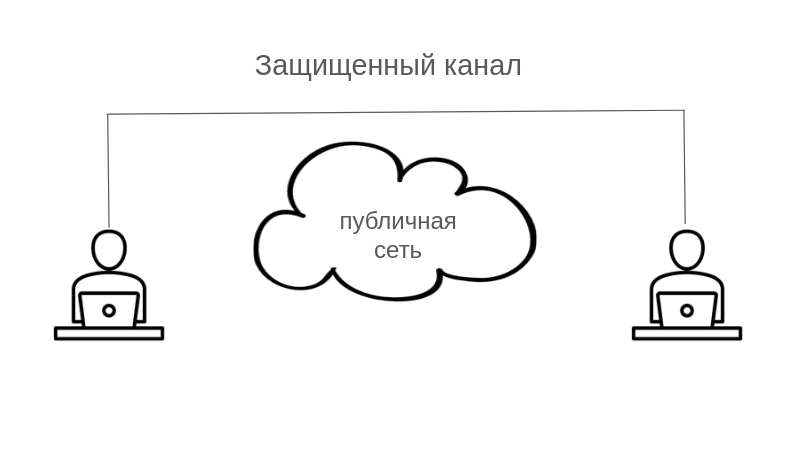
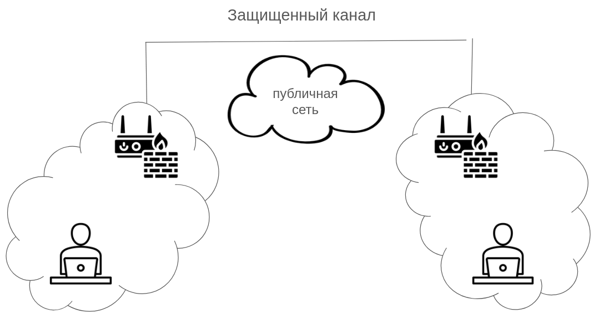
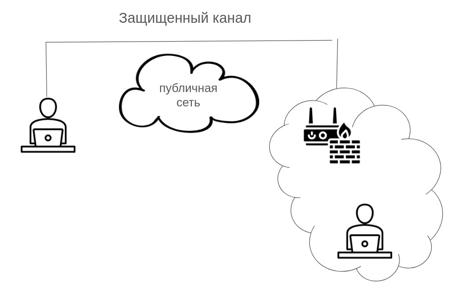
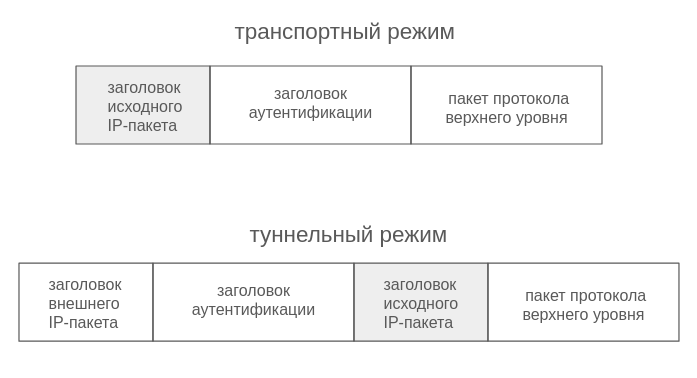

---
## Front matter
title: "Доклад по курсу «Основы информационной безопасности»"
subtitle: "Виртуальные частные сети"
author: "Полина Витальевна Барабаш"

## Generic otions
lang: ru-RU
toc-title: "Содержание"

## Bibliography
bibliography: bib/cite.bib
csl: pandoc/csl/gost-r-7-0-5-2008-numeric.csl

## Pdf output format
toc: true # Table of contents
toc-depth: 2
lof: true # List of figures
lot: true # List of tables
fontsize: 12pt
linestretch: 1.5
papersize: a4
documentclass: scrreprt
## I18n polyglossia
polyglossia-lang:
  name: russian
  options:
	- spelling=modern
	- babelshorthands=true
polyglossia-otherlangs:
  name: english
## I18n babel
babel-lang: russian
babel-otherlangs: english
## Fonts
mainfont: PT Serif
romanfont: PT Serif
sansfont: PT Sans
monofont: PT Mono
mainfontoptions: Ligatures=TeX
romanfontoptions: Ligatures=TeX
sansfontoptions: Ligatures=TeX,Scale=MatchLowercase
monofontoptions: Scale=MatchLowercase,Scale=0.9
## Biblatex
biblatex: true
biblio-style: "gost-numeric"
biblatexoptions:
  - parentracker=true
  - backend=biber
  - hyperref=auto
  - language=auto
  - autolang=other*
  - citestyle=gost-numeric
## Pandoc-crossref LaTeX customization
figureTitle: "Рис."
tableTitle: "Таблица"
listingTitle: "Листинг"
lofTitle: "Список иллюстраций"
lotTitle: "Список таблиц"
lolTitle: "Листинги"
## Misc options
indent: true
header-includes:
  - \usepackage{indentfirst}
  - \usepackage{float} # keep figures where there are in the text
  - \floatplacement{figure}{H} # keep figures where there are in the text
---

# Введение

**Виртуальная частная сеть (VPN — Virtual Private Network)** — «сетевая инфраструктура, в которой компоненты частной сети связываются между собой с помощью публичной сети», позволяя безопасно передавать и получать данные так, будто это одна частная сеть [@sherbak]. 

Основная цель технологии VPN — обеспечение конфиденциальности, целостности и доступности данных при передаче их через ненадежные среды [@mihalina].

Данная технология является недорогим решением для реализации междугородной сети, что является актуальным для компаний, так как в настоящее время наблюдается тренд на глобализацию и удаленную работу [@hesus]. 

Данный доклад ставит своей целью рассмотреть VPN как технологию и разобраться в принципах её работы.

# Основная часть

## Сферы применения виртуальных частных сетей

Можно выделить три основные стратегии использования технологии виртуальных частных сетей [@hesus]. 

1. Связывание географически разделенных организаций, например, если у компании есть офисы в Москве и Санкт-Петербурге. 

До появления общедоступных сетей организации обычно арендовали выделенную телефонную линию, чтобы организовать связь между удаленными подразделениями. Такая выделенная сеть называется частной сетью и хорошо защищена, злоумышленникам необходимо физически подключаться к линиям, чтобы перехватить данные. Проблема такого решения — дороговизна. С появлением и распространением сетей общего доступа и интернета, стало логичным использовать доступную инфраструктуру, но необходимо было обеспечить безопасность такого использования. Для этого и была разработана технология виртуальных частных сетей [@tanenbaum].

2. Возможность получить доступ к корпоративной сети сотрудникам, работающим удалённо или находящимся в командировке.

До появления технологии VPN сотрудники, работающие удаленно передавали свои наработки через физические носители в офис, использовали факс или средства телефонии. Не было какого-то единого безопасного связывающего решения.

3. Внутренний VPN, реализующий соединение внутри локальной сети, то есть сервер и клиент находятся в одной физической сети.

Такую стратегию использования VPN можно считать побочной, так как связь здесь проходит не по публичной сети, следствием чего становится необходимы средства защиты соединения. Однако в данном случае используется как раз следствие безопасности — можно дополнительно защитить соединение внутри локальной сети. Также функцией VPN в данном сценарии может быть логическая сегментация сети.

## Принципы Работы VPN

### Способы образования канала VPN

Технология vpn создает защищенный канал, существует несколько вариантов образования такого канала в зависимости от расположения ПО [@olifer] : 

1. схема с конечными узлами (такую схему называют «точка — точка») (рис. [-@fig:001]);

2. схема с оборудованием, расположенным на границе между частной и публичной сетями (рис. [-@fig:002]);

4. комбинированная схема, использующая в качестве одного входа-выхода конечный узел, а в качестве другого — оборудование (рис. [-@fig:003]).

{#fig:001 width=70%}

{#fig:002 width=70%}

{#fig:003 width=70%}

Преимуществом первого варианта образования канала является полная защищенность на всем пути следования данных. Однако недостатком является избыточность (уязвимость телефонной сети или выделенных каналов, по которым локальные сети подключаются к территориальной сети меньше, чем у сетей с коммутацией пакетов) и децентрализованность (для каждого узла необходимо отдельно устанавливать, конфигурировать и администрировать использование VPN) [@olifer]. 

Второй вариант позволяет настроить маштабируемое и централизованно управляемое решение. У него также есть сложности в выборе оборудования (и поставщиков оборудования) и его настройке [@olifer]. Возможность настроить VPN-соединение есть у некоторых маршрутизаторов, однако чаще всего развертывают сеть на межсетевых экранах, так как межсетевые экраны — «основа сетевой безопасности» и естественно считать их границей между компанией и интернетом [@tanenbaum].

### Туннелирование

Логическое соединение двух частных сетей осуществляется за счет туннелирования. Туннель — сетевое соединение, внутри которого происходит инкапсуляция пакетов, то есть исходный пакет упаковывается в другой пакет, добавляется дополнительный заголовок, содержащий маршрутные данные. В конце туннеля пакеты декапсулируются (распаковываются) и поступают получателю в исходном виде [@sherbak]. 

Стоит отметить, что туннелирование используется в большинстве случаев реализации VPN. Однако существуют варианты организации соединения без создания туннеля. Например, IPsec, помимо туннельного режима, может работать в транспортном режиме. В этом режиме заголовок IPsec вставляется сразу после заголовка IP, в то время как в режиме туннелирования весь IP-пакет вместе с заголовком вставляется в новый IP-пакет (рис. [-@fig:004]).

{#fig:004 width=70%}

### Шифрование

Следующий важный для виртуальных частных сетей аспект — шифрование. Как и в случае с туннелированием, шифрование не строго обязательный компонент VPN, однако использование шифрования скорее общепринятый стандарт, так как для конфиденциальной передачи данных через общедоступные сети оно необходимо (а это основная стратегия использования VPN).

Можно выделить два процесса шифрования: на этапе аутентификации и собственно шифрование передаваемых данных (трафика). 

Основные алгоритмы шифрования аутентификации:

- Асимметричное шифрование (для обмена ключами)

- Хэширование (для подписей и проверки целостности)

Для шифрования трафика используется симметричное шифрование, так как оно быстрее, чем ассиметричное [@infratech].

### Аутентификация

Реализация аутентификации — необходимый компонент виртуальных частных сетей, так как это основа для безопасного соединения, чтобы доступ не был получен теми, кому он не предназначен.

В разделе шифрования мы уже затронули тему шифрования при аутентификации. 

### Процесс создания соединения в виртуальной частной сети

Перед тем как перейти к рассмотрению VPN-протоколов, рассмотрим общий принцип взаимодействия в виртуальных частных сетях. Можно выделить следующую универсальную последовательность действий [@lavigne]:

1. Идентификация узлов перед созданием соединения

2. Аутентификация узлов, чтобы удостовериться, что это действительные участники соединения

3. Сверка политик безопасности, которые должны обязательно совпадать для соединения

4. При прохождении всех предыдущих этапов открывается соединение и можно передавать данные

## Протоколы виртуальных частных сетей

Информация о различных протоколах взята из источника [@protocol] и представлена в [табл. @tbl:01].

|    Название                |    Скорость         |    Безопасность                      |       Настройка     |       Комментарии                                           |
|---------------------------------|-------------------------|------------------------------|-------------------------|------------------------------------------------------------|
|    PPTP              |    Высокая          |  Низкая       |        Простая      |    Устаревший, лучше не использовать                                         |
|    L2TP / IPSec      |    Средняя          |  Высокая      |        Средняя      |    Работает медленно за счет двойной инкапсуляции                            |
|    OpenVPN           |    Средняя          |  Высокая      |     Ниже среднего   |    Очень гибкие настройки                                                    |
|    SSTP              |    Средняя          |  Высокая      |       Простая       |    Только Windows, нет клиентов для других ОС                                |
|    IKEv2 / IPSec     |    Высокая          |  Высокая      |       Средняя       |    Очень быстрое переподключение (отличный вариант для мобильных устройств)  |
|    WireGuard         |    Очень высокая    |  Высокая      |       Простая       |    Статические IP, заблокированы в Китае, России, Иране                      |

: Сравнительная таблица протоколов VPN {#tbl:01}

# Заключение

В данном докладе была рассмотрена технология виртуальных частных сетей, выделены основные принципы, лежащие в основе VPN, а также рассмотрены основные протоколы.

Резюме:

- VPN позволяет проложить безопасное соединение поверх небезопасной сети;

- Существуют различные способы расположения границ безопасной сети и небезопасной;

- Аутентификация, туннелирование и шифрование — стандарт VPN;

- Существуют различные протоколы VPN, имеющие свои особенности.

# Список литературы{.unnumbered}

::: {#refs}
:::
