---
## Front matter
lang: ru-RU
title: Презентация по этапу внешнего курса «Основы кибербезопасности»
subtitle: Часть 1. Безопасность в сети
author:
  - Барабаш П. В.
institute:
  - Российский университет дружбы народов, Москва, Россия
date: 16 мая 2026

## i18n babel
babel-lang: russian
babel-otherlangs: english

## Formatting pdf
toc: false
toc-title: Содержание
slide_level: 2
aspectratio: 169
section-titles: true
theme: metropolis
header-includes:
 - \metroset{progressbar=frametitle,sectionpage=progressbar,numbering=fraction}
 - '\makeatletter'
 - '\beamer@ignorenonframefalse'
 - '\makeatother'
 
 
## Fonts
mainfont: PT Serif
romanfont: PT Serif
sansfont: PT Sans
monofont: PT Mono
mainfontoptions: Ligatures=TeX
romanfontoptions: Ligatures=TeX
sansfontoptions: Ligatures=TeX,Scale=MatchLowercase
monofontoptions: Scale=MatchLowercase,Scale=0.9

---

## Докладчик

:::::::::::::: {.columns align=center}
::: {.column width="70%"}

  * Барабаш Полина Витальевна
  * студентка 2 курса, НПИбд-02-24
  * Российский университет дружбы народов
  * [1132231841@rudn.ru](mailto:1132231841@rudn.ru)

:::
::: {.column width="30%"}

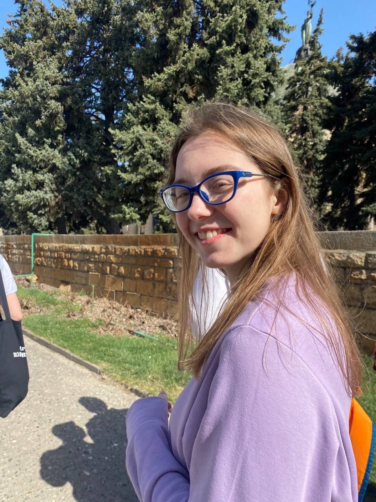

:::
::::::::::::::

## Цели и задачи

Цель: получение знаний о базовых сетевых протоколах, персонализации сети, браузере TOR и беспроводных сетях.

## Задание 1

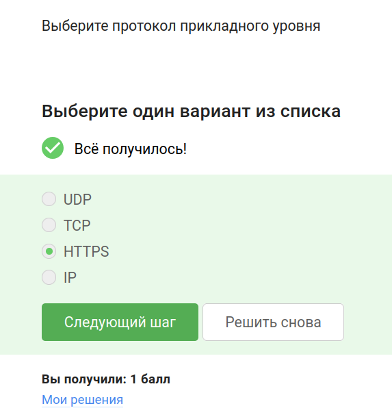

## Задание 2

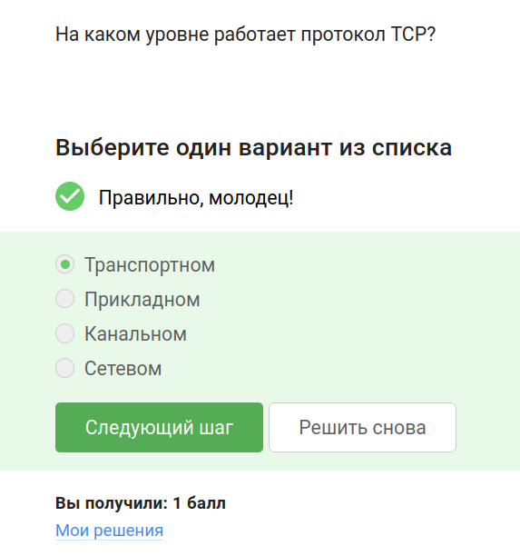

## Задание 3

## Задание 4

## Задание 5

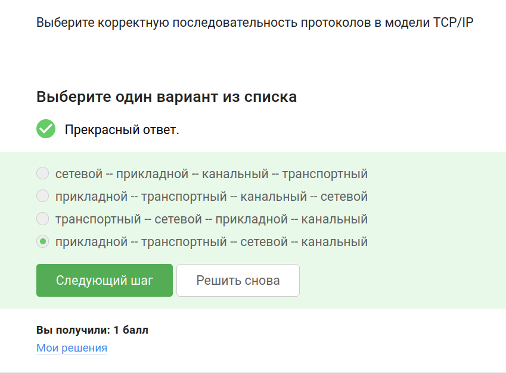

## Задание 6

## Задание 7

## Задание 8

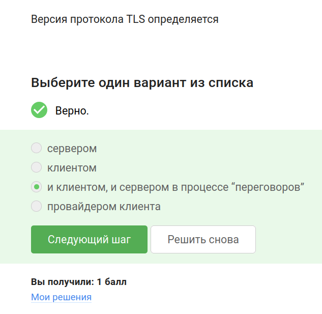

## Задание 9

## Задание 10

## Задание 11

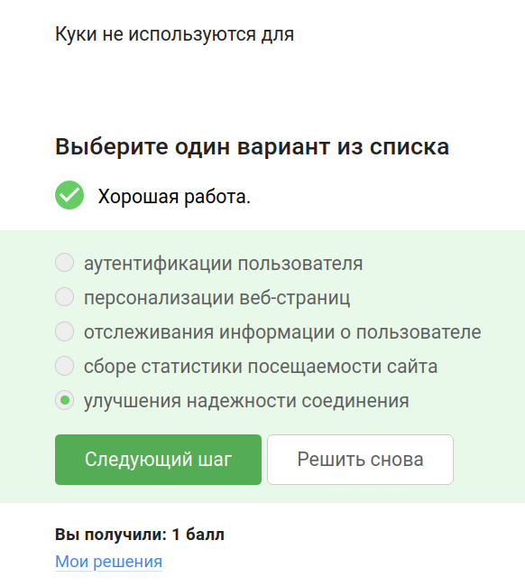

## Задание 12

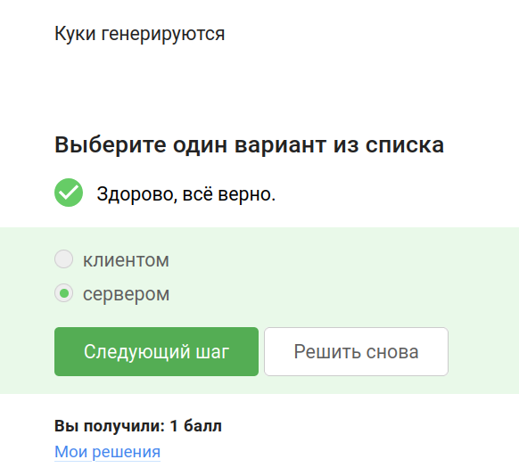

## Задание 13

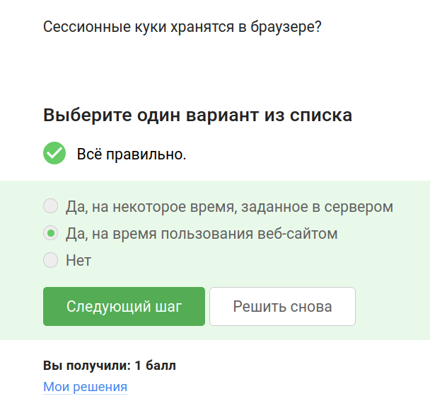

## Задание 14

## Задание 15

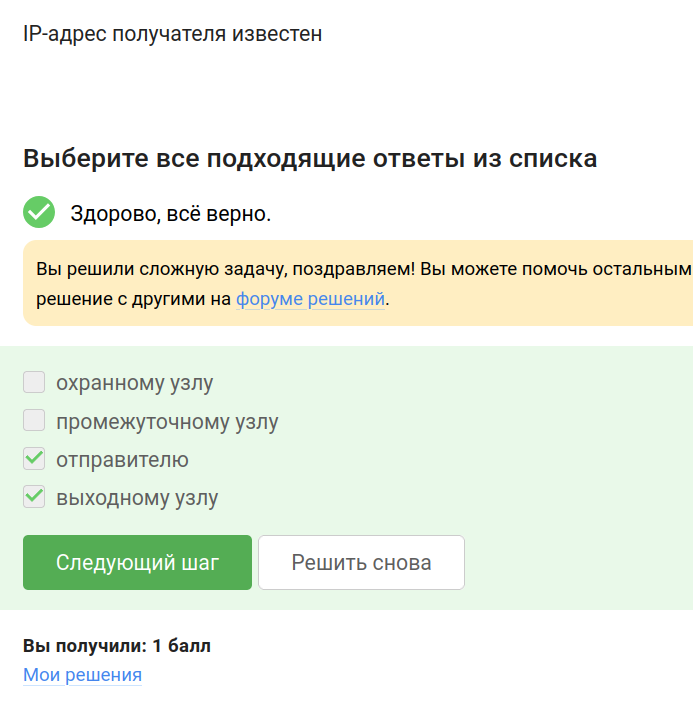

## Задание 16

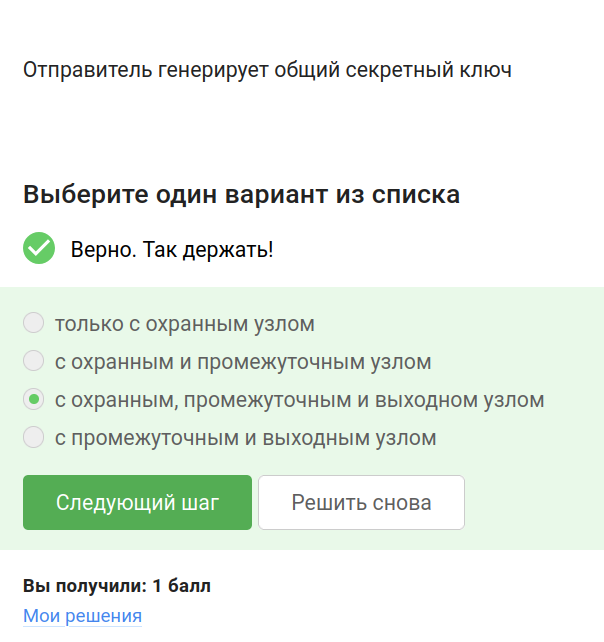

## Задание 17

## Задание 18

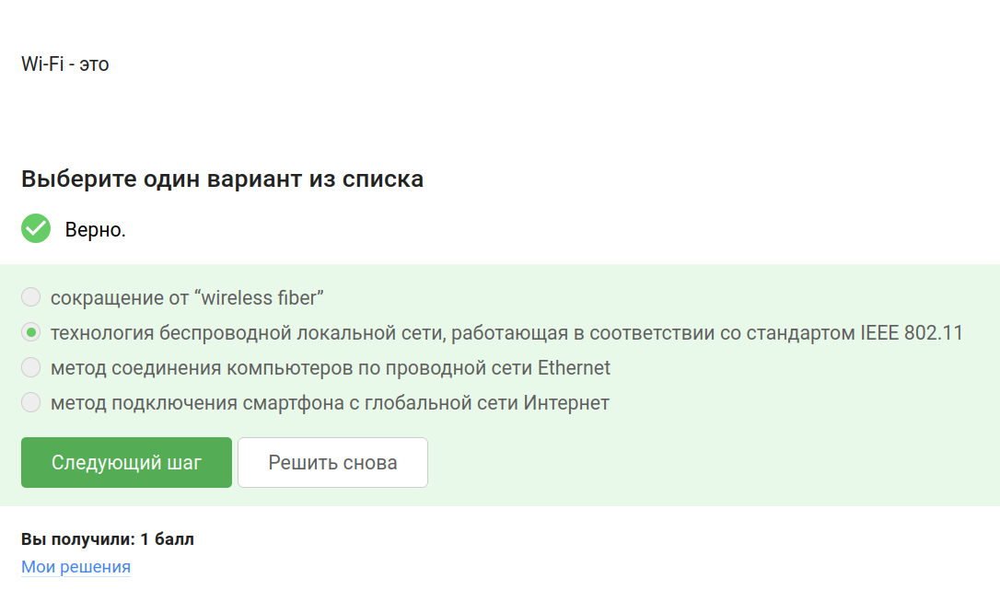

## Задание 19

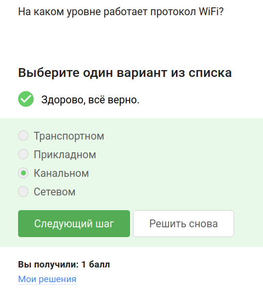

## Задание 20

## Задание 21

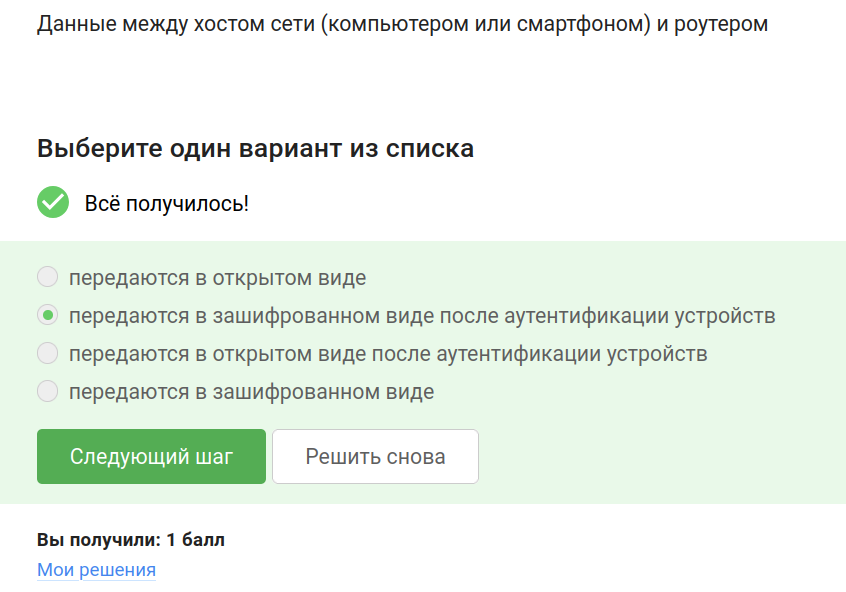

## Задание 22

## Выводы

При выполнении этой части внешнего курса я закрепила свои знания о базовых сетевых протоколах, узнала больше о персонализации сети, браузере TOR и беспроводных сетях.
