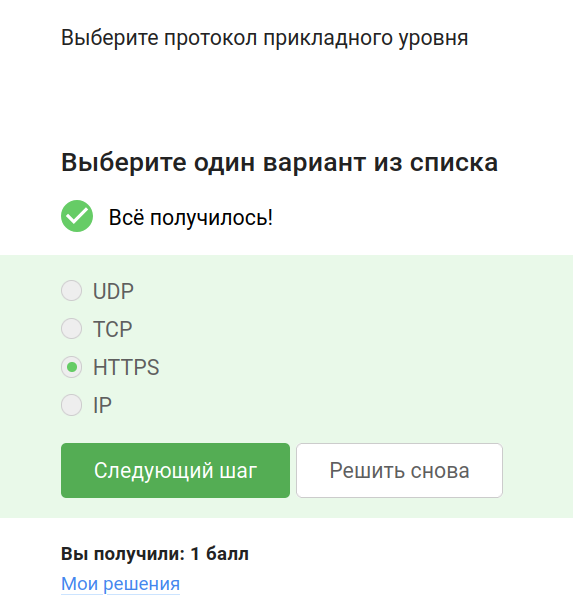
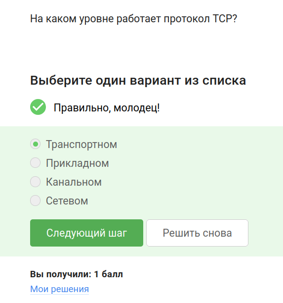
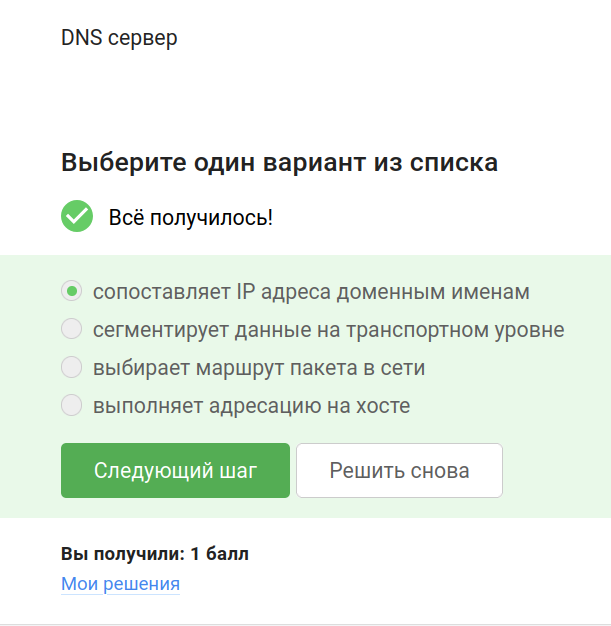
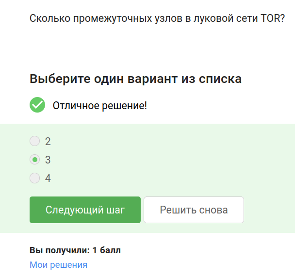
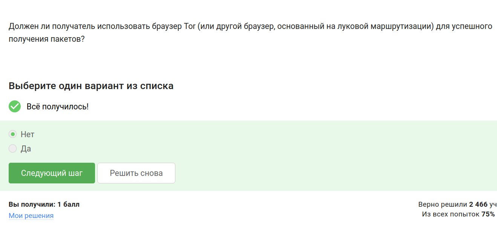
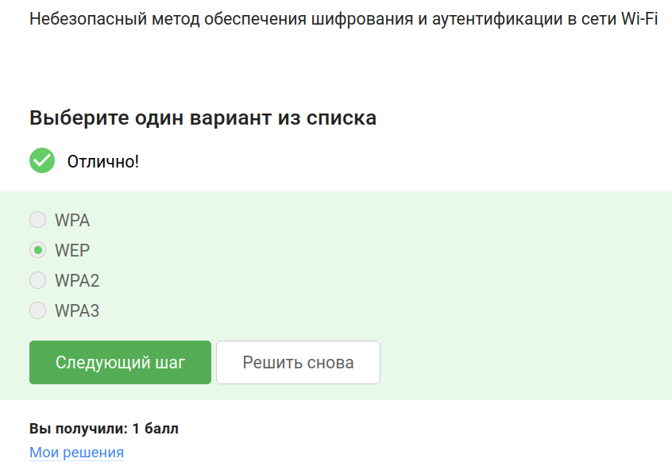
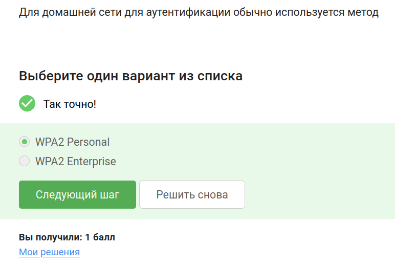

---
## Front matter
title: "Отчёт по выполнению внешнего курса «Основы кибербезопасности»"
subtitle: "Часть 1. Безопасность в сети"
author: "Полина Витальевна Барабаш"

## Generic otions
lang: ru-RU
toc-title: "Содержание"

## Bibliography
bibliography: bib/cite.bib
csl: pandoc/csl/gost-r-7-0-5-2008-numeric.csl

## Pdf output format
toc: true # Table of contents
toc-depth: 2
lof: true # List of figures
lot: true # List of tables
fontsize: 12pt
linestretch: 1.5
papersize: a4
documentclass: scrreprt
## I18n polyglossia
polyglossia-lang:
  name: russian
  options:
	- spelling=modern
	- babelshorthands=true
polyglossia-otherlangs:
  name: english
## I18n babel
babel-lang: russian
babel-otherlangs: english
## Fonts
mainfont: PT Serif
romanfont: PT Serif
sansfont: PT Sans
monofont: PT Mono
mainfontoptions: Ligatures=TeX
romanfontoptions: Ligatures=TeX
sansfontoptions: Ligatures=TeX,Scale=MatchLowercase
monofontoptions: Scale=MatchLowercase,Scale=0.9
## Biblatex
biblatex: true
biblio-style: "gost-numeric"
biblatexoptions:
  - parentracker=true
  - backend=biber
  - hyperref=auto
  - language=auto
  - autolang=other*
  - citestyle=gost-numeric
## Pandoc-crossref LaTeX customization
figureTitle: "Рис."
tableTitle: "Таблица"
listingTitle: "Листинг"
lofTitle: "Список иллюстраций"
lotTitle: "Список таблиц"
lolTitle: "Листинги"
## Misc options
indent: true
header-includes:
  - \usepackage{indentfirst}
  - \usepackage{float} # keep figures where there are in the text
  - \floatplacement{figure}{H} # keep figures where there are in the text
---

# Цель работы

Получение знаний о базовых сетевых протоколах, персонализации сети, браузере TOR и беспроводных сетях.

# Выполнение

###  Как работает интернет: базовые сетевые протоколы

**Задание 1.** Выберите протокол прикладного уровня из списка: UDP, TCP, HTTPS, IP.

Правильный ответ: HTTPS. Именно он является протоколом прикладного уровня, по которому передаются веб-страницы (рис. [-@fig:001]).

{#fig:001 width=70%}

**Задание 2.** На каком уровне работает протокол TCP? Транспортном, прикладном, канальном, сетевом?

Правильный ответ: транспортном. Протокол TCP - это самый популярный протокол транспортного уровня, и основная его задача - обеспечить надежную передачу данных между процессами на разных машинах, то есть между моим запросом, набранным в браузере, веб-серверу, где этот веб-сайт лежит [@stepic] (рис. [-@fig:002]).

{#fig:002 width=70%}

 
**Задание 3.** Выберите все корректные адреса IPv4: 421.0.15.19, 43.12.256.7, 90.11.90.22, 25.198.0.15 

IP адреса версии IPv4 должны состоять из 4 чисел, разделенных точками, в диапазоне от 0 до 255. Следовательно, из преведенных адресов корректными являются 90.11.90.22 и 25.198.0.15 (рис. [-@fig:003]).

{#fig:003 width=70%}

**Задание 4.** DNS сервер: сопоставляет IP адреса доменным именам, сегментирует данные на транспортном уровне, выбирает маршрут пакета в сети, выполняет адресацию на хосте?

Правильный ответ: сопоставляет IP адреса доменным именам. Основная задача DNS (Domain Name Server) -- сопоставить название, то есть доменное имя, с корректным IP-адресом, с тем, где лежит этот сервер, этот сайт [@stepic] (рис. [-@fig:004]).

{#fig:004 width=70%}

**Задание 5.** Выберите корректную последовательность протоколов в модели TCP/IP.

Правильная последовательность протоколов в модели TCP/IP: прикладной -- транспортный -- сетевой -- канальный (рис. [-@fig:005]).

{#fig:005 width=70%}

**Задание 6.** Протокол http предполагает...

передачу данных между клиентом и сервером в открытом виде. А в зашифрованном виде передает https (рис. [-@fig:006]).

{#fig:006 width=70%}

**Задание 7.** Протокол https состоит из...

двух фаз: рукопожатия и передачи данных. Во время рукопожатия происходит выбор параметров, протоколов, аутентификация (как минимум, сервера), формирование общего секретного ключа K (рис. [-@fig:007]).

{#fig:007 width=70%}

**Задание 8.** Версия протокола TLS определяется...

и клиентом, и сервером в процессе “переговоров”, так как версия TLS должна подходит и клиенту, и серверу (рис. [-@fig:008]).

{#fig:008 width=70%}

**Задание 9.** В фазе “рукопожатия” протокола TLS не предусмотрено...

шифрование данных. Шифрование данных начинается после завершения фазы “рукопожатия” (рис. [-@fig:009]).

{#fig:009 width=70%}

### Персонализация сети

**Задание 10.** Куки хранят: пароль пользователя, IP адрес, id сессии, идентификатор пользователя?

Куки хранят id сессии и идентификатор пользователя, так как суть куков в том, что идентифицировать пользователя и контент, связанный именно с ним (рис. [-@fig:010]).

{#fig:010 width=70%}

**Задание 11.** Куки не используются для аутентификации пользователя, персонализации веб-страниц, отслеживания информации о пользователе, сборе статистики посещаемости сайта, улучшения надежности соединения?

Куки не используются для улучшения надежности соединения, так как соединение совершенно другая плоскость (рис. [-@fig:011]).

{#fig:011 width=70%}

**Задание 12.** Куки генерируются клиентом или сервером?

Куки генерируются сервером, хотя хранятся они уже на клиенте (браузером) (рис. [-@fig:012]).

{#fig:012 width=70%}

**Задание 13.** Сессионные куки хранятся в браузере?

Правильной ответ: Да, на время пользования веб-сайтом. Это особенность именно сессионных куки, срок хранения же имеют постоянные куки (рис. [-@fig:013]).

{#fig:013 width=70%}

### Браузер TOR. Анонимизация

**Задание 14.** Сколько промежуточных узлов в луковой сети TOR?

Правильный ответ: 3. Это минимальное и достаточное количество для анонимизации пользователя (рис. [-@fig:014]).

{#fig:014 width=70%}

**Задание 15.** IP-адрес получателя известен охранному узлу, промежуточному узлу, отправителю, выходному узлу?

Правильный ответ: отправителю, выходному узлу. Охранный узел знает только отправителя, а промежуточный не знает ни того, ни другого (рис. [-@fig:015]).

{#fig:015 width=70%}

**Задание 16.** Отправитель генерирует общий секретный ключ... 

с охранным, промежуточным и выходном узлом. Но в то же время существует отдельное генерирование попарных ключей между узлами (рис. [-@fig:016]).

{#fig:016 width=70%}

**Задание 17.** Должен ли получатель использовать браузер Tor (или другой браузер, основанный на луковой маршрутизации) для успешного получения пакетов?

Правильный ответ: нет. IP-адрес не зависит от браузера, а отправитель должен знать своего получателя и браузер на это не оказывает влияния (рис. [-@fig:017]).

{#fig:017 width=70%}

### Беспроводные сети Wi-fi

**Задание 18.** Wi-Fi - это...

технология беспроводной локальной сети, работающая в соответствии со стандартом IEEE 802.11 (рис. [-@fig:018]).

{#fig:018 width=70%}

**Задание 19.** На каком уровне работает протокол WiFi?

WiFi - технология канального уровня (рис. [-@fig:019]).

{#fig:019 width=70%}

**Задание 20.** Небезопасный метод обеспечения шифрования и аутентификации в сети Wi-Fi: WPA, WEP, WPA2, WPA3?

Правильный ответ: WEP. Это самый ранний метод обеспечения шифрования и аутентификации в сети Wi-Fi. Он устарел, в частности, потому, что использовал малую длину ключа: так, например, он использовал длину ключа в 40 бит, это довольно мало на сегодняшний день, он может быть легко взломан (рис. [-@fig:020]).

{#fig:020 width=70%}

**Задание 21.** Данные между хостом сети (компьютером или смартфоном) и роутером...

передаются в зашифрованном виде после аутентификации устройств (рис. [-@fig:021]).

{#fig:021 width=70%}

**Задание 22.** Для домашней сети для аутентификации обычно используется метод WPA2 Personal или WPA2 Enterprise?

Правильный ответ: WPA2 Personal (рис. [-@fig:022]).

{#fig:022 width=70%}

# Выводы

При выполнении этой части внешнего курса я закрепила свои знания о базовых сетевых протоколах, узнала больше о персонализации сети, браузере TOR и беспроводных сетях.

# Список литературы{.unnumbered}

::: {#refs}
:::
