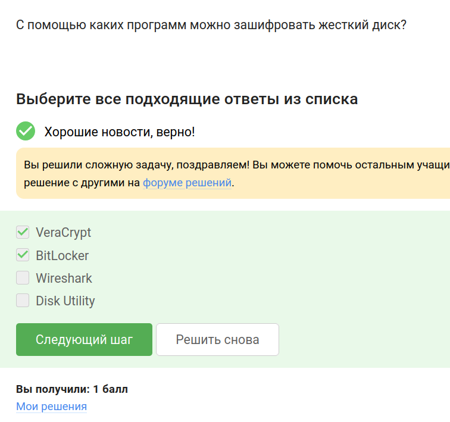
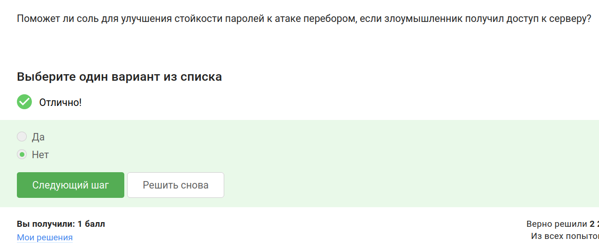
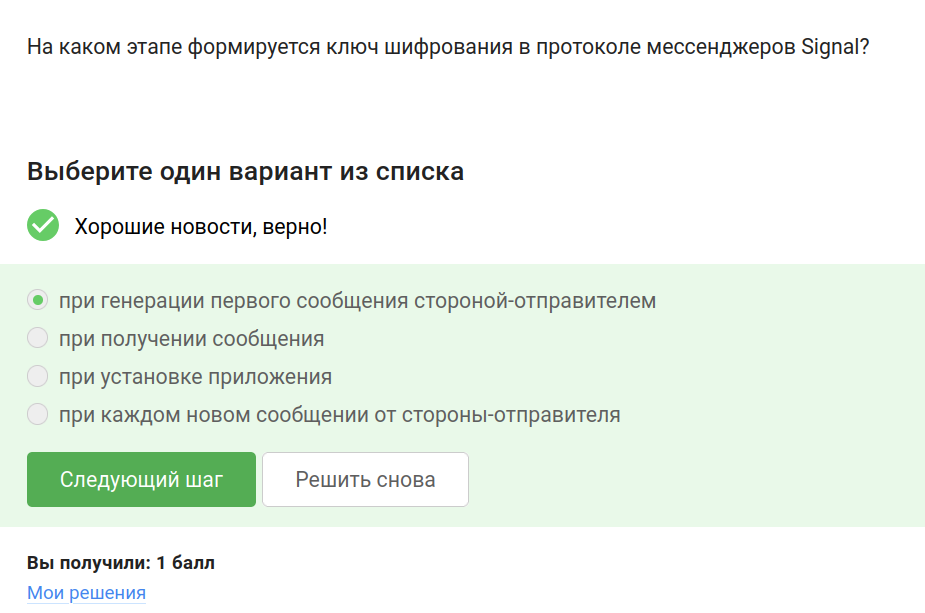
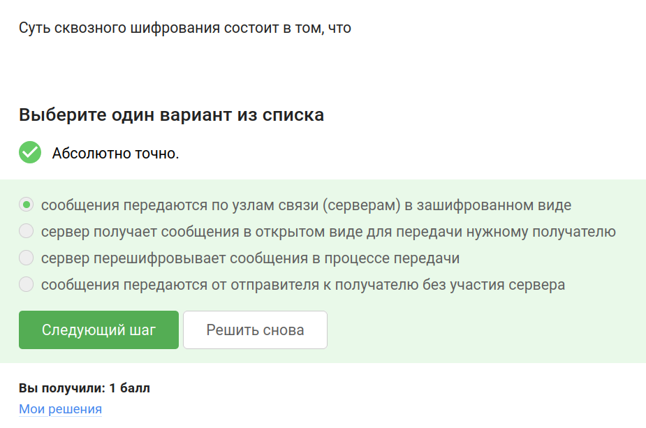

---
## Front matter
title: "Отчёт по выполнению внешнего курса «Основы кибербезопасности»"
subtitle: "Часть 2. Защита ПК/телефона"
author: "Полина Витальевна Барабаш"

## Generic otions
lang: ru-RU
toc-title: "Содержание"

## Bibliography
bibliography: bib/cite.bib
csl: pandoc/csl/gost-r-7-0-5-2008-numeric.csl

## Pdf output format
toc: true # Table of contents
toc-depth: 2
lof: true # List of figures
lot: true # List of tables
fontsize: 12pt
linestretch: 1.5
papersize: a4
documentclass: scrreprt
## I18n polyglossia
polyglossia-lang:
  name: russian
  options:
	- spelling=modern
	- babelshorthands=true
polyglossia-otherlangs:
  name: english
## I18n babel
babel-lang: russian
babel-otherlangs: english
## Fonts
mainfont: PT Serif
romanfont: PT Serif
sansfont: PT Sans
monofont: PT Mono
mainfontoptions: Ligatures=TeX
romanfontoptions: Ligatures=TeX
sansfontoptions: Ligatures=TeX,Scale=MatchLowercase
monofontoptions: Scale=MatchLowercase,Scale=0.9
## Biblatex
biblatex: true
biblio-style: "gost-numeric"
biblatexoptions:
  - parentracker=true
  - backend=biber
  - hyperref=auto
  - language=auto
  - autolang=other*
  - citestyle=gost-numeric
## Pandoc-crossref LaTeX customization
figureTitle: "Рис."
tableTitle: "Таблица"
listingTitle: "Листинг"
lofTitle: "Список иллюстраций"
lotTitle: "Список таблиц"
lolTitle: "Листинги"
## Misc options
indent: true
header-includes:
  - \usepackage{indentfirst}
  - \usepackage{float} # keep figures where there are in the text
  - \floatplacement{figure}{H} # keep figures where there are in the text
---

# Цель работы

Получение знаний о шифровании, паролях, фишинге вирусах и безопасности мессенджеров.

# Выполнение

### Шифрование диска

**Задание 1.** Можно ли зашифровать загрузочный сектор диска?

Правильный ответ: да. Диск можно зашифровать целиком, а можно избранные секторы (рис. [-@fig:001]).

{#fig:001 width=70%}

**Задание 2.** Шифрование диска основано на...

симметричном шифровании, так как оно достаточно быстрое и эффективное для больших объёмов данных [@stepic] (рис. [-@fig:002]).

{#fig:002 width=70%}

 
**Задание 3.** С помощью каких программ можно зашифровать жесткий диск?

Правильный ответ: VeraCrypt, BitLocker. (рис. [-@fig:003]).

{#fig:003 width=70%}

### Пароли

**Задание 4.** Какие пароли можно отнести с стойким: qwertty12345, ILOVECATS, UQr9@j4!S$, IDONTLOVECATS? 

Чтобы пароль считался стойким, он должен быть достаточной длины, не быть какой-то популярной фразом, использовать комбинацию как заглавных, так и строчных букв, цифр и символов. Такой пароль будет долго подобрать [@stepic] Из указанных паролей только UQr9@j4!S$ можно назвать стойким (рис. [-@fig:004]).

{#fig:004 width=70%}

**Задание 5.** Где безопасно хранить пароли?

Правильный ответ: в менеджерах паролей. Можно запомнить только один пароль, а все остальные хранить в менеджере паролей. Остальные варианты не безопасны (рис. [-@fig:005]).

{#fig:005 width=70%}

**Задание 6.** Зачем нужна капча?

Для защиты от автоматизированных атак, направленных на получение несанкционированного доступа (рис. [-@fig:006]).

{#fig:006 width=70%}

**Задание 7.** Для чего применяется хэширование паролей?

Для того, чтобы не хранить пароли на сервере в открытом виде. Крайне много ресурсов понадобится, чтобы найти прообраз хэша (рис. [-@fig:007]).

{#fig:007 width=70%}

**Задание 8.** Поможет ли соль для улучшения стойкости паролей к атаке перебором, если злоумышленник получил доступ к серверу?

Правильный ответ: нет. Если злоумышленник получил доступ к серверу, то ему будет доступна использующаяся соль, так как она генерируется на стороне сервера (рис. [-@fig:008]).

{#fig:008 width=70%}

**Задание 9.** Какие меры защищают от утечек данных атакой перебором?

разные пароли на всех сайтах (чтобы при утечки одного пароля, с помощью него же не получили доступ к другим ресурсам), периодическая смена паролей (если один пароль на протяжении долгого времени, то за это время он может быть подобран), сложные(=длинные) пароли (больше вариантов паролей, поэтому перебор усложняется), капча (призвана защитить от атоматического введения паролей программой) (рис. [-@fig:009]).

{#fig:009 width=70%}

### Фишинг

**Задание 10.** Какие из следующих ссылок являются фишинговыми?

https://online.sberbank.wix.ru/CSAFront/index.do (вход в Сбербанк.Онлайн), так как можно заметить wix перед доменом ru; https://passport.yandex.ucoz.ru/auth?origin=home_desktop_ru (вход в аккаунт Яндекс), так как опять же несуществующая у реального ресурса ucoz перед ru (рис. [-@fig:010]).

{#fig:010 width=70%}

**Задание 11.** Может ли фишинговый имейл прийти от знакомого адреса?

Правильный ответ: да. Злоумышленник может взломать почтовый ящик человека, а также существуют механизмы подмены адресов (рис. [-@fig:011]).

{#fig:011 width=70%}

### Вирусы

**Задание 12.** Email Спуфинг -- это...

подмена адреса отправителя в имейлах (рис. [-@fig:012]).

{#fig:012 width=70%}

**Задание 13.** Вирус-троян...

маскируется под легитимную программу (рис. [-@fig:013]).

{#fig:013 width=70%}

### Безопасность мессенджеров

**Задание 14.** На каком этапе формируется ключ шифрования в протоколе мессенджеров Signal?

при генерации первого сообщения стороной-отправителем (потом периодически он меняется, но основывается на первом ключе шифрования) (рис. [-@fig:014]).

{#fig:014 width=70%}

**Задание 15.** Суть сквозного шифрования состоит в том, что

сообщения передаются по узлам связи (серверам) в зашифрованном виде, то есть расшифрованное сообщении видит только отправитель и получатель (рис. [-@fig:015]).

{#fig:015 width=70%}

# Выводы

При выполнении этой части внешнего курса я узнала больше о методах защиты и о уязвимостях ПК и мобильных телефонов, о шифровании дисков, стойкости паролей, фишинге и вирусах.

# Список литературы{.unnumbered}

::: {#refs}
:::
