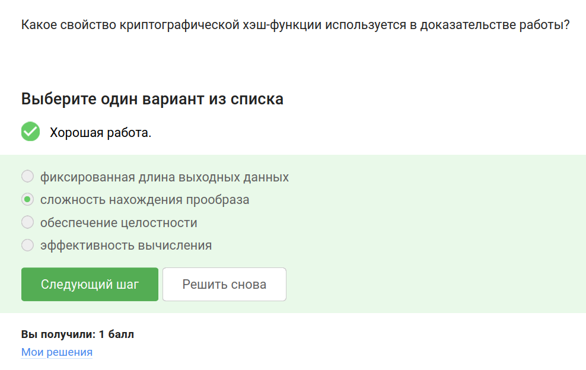
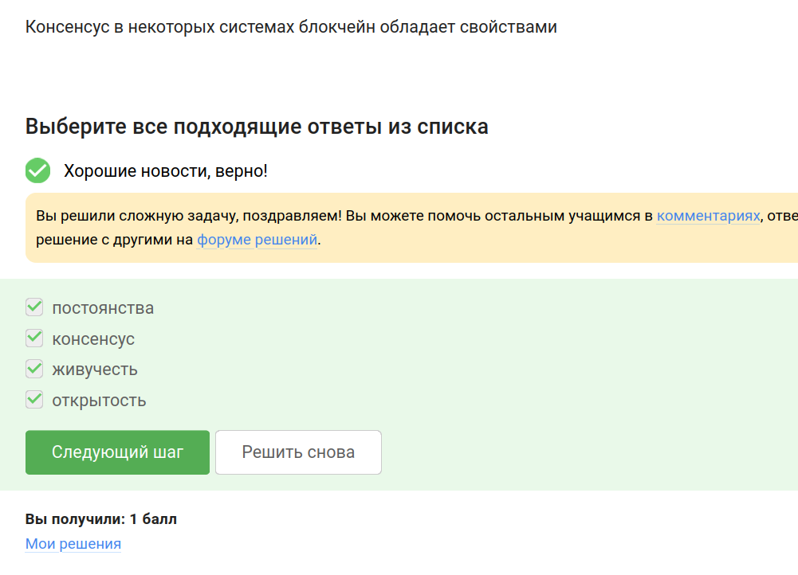
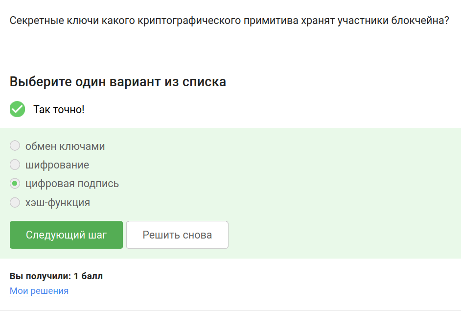

---
## Front matter
title: "Отчёт по выполнению внешнего курса «Основы кибербезопасности»"
subtitle: "Часть 3. Криптография на практике"
author: "Полина Витальевна Барабаш"

## Generic otions
lang: ru-RU
toc-title: "Содержание"

## Bibliography
bibliography: bib/cite.bib
csl: pandoc/csl/gost-r-7-0-5-2008-numeric.csl

## Pdf output format
toc: true # Table of contents
toc-depth: 2
lof: true # List of figures
lot: true # List of tables
fontsize: 12pt
linestretch: 1.5
papersize: a4
documentclass: scrreprt
## I18n polyglossia
polyglossia-lang:
  name: russian
  options:
	- spelling=modern
	- babelshorthands=true
polyglossia-otherlangs:
  name: english
## I18n babel
babel-lang: russian
babel-otherlangs: english
## Fonts
mainfont: PT Serif
romanfont: PT Serif
sansfont: PT Sans
monofont: PT Mono
mainfontoptions: Ligatures=TeX
romanfontoptions: Ligatures=TeX
sansfontoptions: Ligatures=TeX,Scale=MatchLowercase
monofontoptions: Scale=MatchLowercase,Scale=0.9
## Biblatex
biblatex: true
biblio-style: "gost-numeric"
biblatexoptions:
  - parentracker=true
  - backend=biber
  - hyperref=auto
  - language=auto
  - autolang=other*
  - citestyle=gost-numeric
## Pandoc-crossref LaTeX customization
figureTitle: "Рис."
tableTitle: "Таблица"
listingTitle: "Листинг"
lofTitle: "Список иллюстраций"
lotTitle: "Список таблиц"
lolTitle: "Листинги"
## Misc options
indent: true
header-includes:
  - \usepackage{indentfirst}
  - \usepackage{float} # keep figures where there are in the text
  - \floatplacement{figure}{H} # keep figures where there are in the text
---

# Цель работы

Получение знаний о криптографии, в том числе подробнее о цифровой подписи, электронных платежах и блокчейне.

# Выполнение

### Введение в криптографию

**Задание 1.** В асимметричных криптографических примитивах...

обе стороны имеют пару ключей. Приватный (который нельзя никому передавать или публиковать) и публичный (который доступен другим) (рис. [-@fig:001]).

{#fig:001 width=70%}

**Задание 2.** Криптографическая хэш-функция...

стойкая к коллизиям (коллизия -- один хэш для разных прообразов), эффективно вычисляется (чтобы даже для больших файлов быстро вычислялся хэш), дает на выходе фиксированное число бит независимо от объема входных данных (рис. [-@fig:002]).

{#fig:002 width=70%}

 
**Задание 3.** К алгоритмам цифровой подписи относятся

RSA, ECDSA, ГОСТ Р 34.10-2012  (рис. [-@fig:003]).

{#fig:003 width=70%}

**Задание 4.** Код аутентификации сообщения относится к

симметричным примитивам. "Это также симметричный примитив, который берет на вход какой-то ключ (это должен быть другой ключ, не тот, с которого мы шифровали) и сообщение и выдает код аутентификации сообщения. Корректно об этом примитиве думать, как о симметричной версии подписи" [@stepic] (рис. [-@fig:004]).

{#fig:004 width=70%}

**Задание 5.** Обмен ключам Диффи-Хэллмана - это

асимметричный примитив генерации общего секретного ключа. При симметричном шифровании используется общий секретный ключ и каким-то образом необходимо договориться сторонам о нем. Как раз алгоритм действий Диффи-Хэллмана предлагает использовать ассиметричное шифрование, чтобы обменяться общим секретным ключом (рис. [-@fig:005]).

{#fig:005 width=70%}

### Цифровая подпись

**Задание 6.** Протокол электронной цифровой подписи относится к...

протоколам с публичным (или открытым) ключом, по которому можно будет удостовериться в действительного подписи (рис. [-@fig:006]).

{#fig:006 width=70%}

**Задание 7.** Алгоритм верификации электронной цифровой подписи требует на вход

подпись, открытый ключ (так как открытый ключ математически связан с секретным ключом, которым создавалась подпись), сообщение (чтобы убедиться, что оно не было изменено после подписания) (рис. [-@fig:007]).

{#fig:007 width=70%}

**Задание 8.** Электронная цифровая подпись не обеспечивает...

конфиденциальность. Цифровая подпись обеспечивает аутентификацию, неотказ от авторства, целостность, но не использует шифрование сообщения, тем самым не обеспечивая конфиденциальность (рис. [-@fig:008]).

{#fig:008 width=70%}

**Задание 9.** Какой тип сертификата электронной подписи понадобится для отправки налоговой отчетности в ФНС?

усиленная квалифицированная. Только такой тип имеет юридическую силу (рис. [-@fig:009]).

{#fig:009 width=70%}

**Задание 10.** В какой организации вы можете получить квалифицированный сертификат ключа проверки электронной подписи?

в удостоверяющем (сертификационном) центре (рис. [-@fig:010]).

{#fig:010 width=70%}

### Электронные платежи

**Задание 11.** Выберите из списка все платежные системы.

Правильный ответ: MasterCard, МИР. BitCoin -- криптовалюта, SecurePay -- платежный шлюз, POS-терминал и банкомат -- оборудование (рис. [-@fig:011]).

{#fig:011 width=70%}

**Задание 12.** Примером многофакторной аутентификации является...

комбинация проверка пароля + код в sms сообщении, комбинация код в sms сообщении + отпечаток пальца. Многофакторной считается аутентификация, которая использует минимум два разных фактора (то, что человек знает; то, чем человек владеет; то, что часть человека). Пароль -- что человек знает; код в sms сообщении -- то, чем владеет (телефоном, на который приходит код); отпечаток пальца -- то, что часть человека (биометрия); капча -- не аутентифицирует; PIN код -- то, что человек знает (как и пароль в том варианте ответа) (рис. [-@fig:012]).

{#fig:012 width=70%}

**Задание 13.** При онлайн платежах сегодня используется...

 многофакторная аутентификация покупателя перед банком-эмитентом. Однофакторной аутентификации для онлайн платежей было бы недостаточно; банк-эмитент -- банк, обслуживающий покупателя; банк-эквайер -- продавца (рис. [-@fig:013]).

{#fig:013 width=70%}

### Блокчейн

**Задание 14.** Какое свойство криптографической хэш-функции используется в доказательстве работы?

сложность нахождения прообраза, так как требует больших вычислений, для которых нужна энергия (рис. [-@fig:014]).

{#fig:014 width=70%}

**Задание 15.** Консенсус в некоторых системах блокчейн обладает свойствами...

постоянства, консенсус, живучесть, открытость. "В основе любого блокчейна, в частности биткоина, лежит консенсус – соглашение, в терминах криптовалют консенсус - это некая публичная структура данных или ledger (переводится с английского как «бухгалтерская книга»), где просто содержится история всех переводов, хранится список того, кто что кому заплатил, в какое время. Почему консенсус? Потому что эта публичная структура, бухгалтерский учет должен обеспечивать четыре основных свойства. Первое - это постоянство, то есть когда-либо добавленНые данные не должны быть удалены из этой структуры. Второе - это сам консенсус, то есть все участники видят одни и те же данные и соглашаются с одним и теми же данными, исключением могут быть последние пары блоков, то есть последние изменения в этом блокчейне, в этой публичной структуре данных. Третье - это живучесть, это означает, что мы можем добавлять новые транзакции, когда хотим, мы можем осуществлять платежи, когда хотим. И последнее четвертое свойство - это открытость, то есть любой человек может быть участником блокчейна. Это справедливо не для всех блокчейнов, для биткоина это справедливо." [@stepic] (рис. [-@fig:015]).

{#fig:015 width=70%}

**Задание 16.** Секретные ключи какого криптографического примитива хранят участники блокчейна?

цифровая подпись. Её подписываются транзакции (рис. [-@fig:016]).

{#fig:016 width=70%}

# Выводы

При выполнении этой части внешнего курса я узнала больше о криптографии, в том числе подробнее о цифровой подписи, электронных платежах и блокчейне.

# Список литературы{.unnumbered}

::: {#refs}
:::
